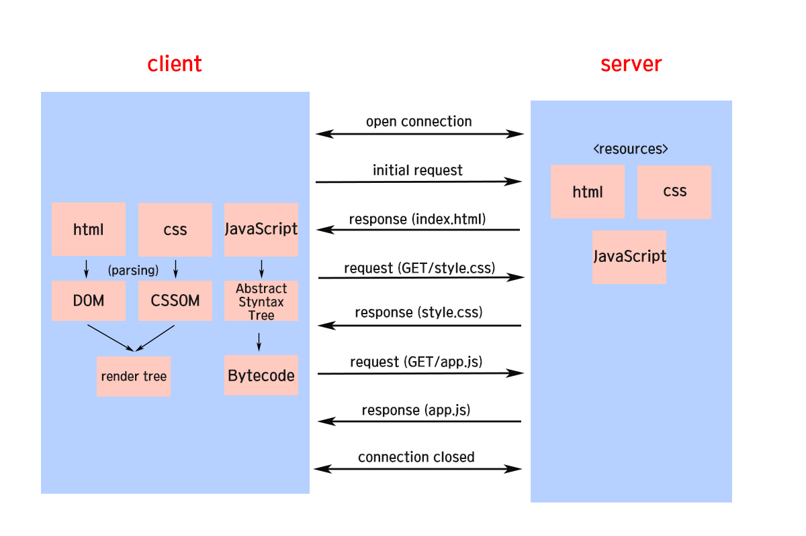

# Index

[1. 자바스크립트란](#자바스크립트란)  
[2. 변수](#변수)  
[3. 데이터 타입](#데이터-타입)  
[4. 단축 평가](#단축-평가)  
[5. 객체](#객체)  
[6. 함수](#함수)  
[7. 스코프](#스코프)  
[8. 프로퍼티 어트리뷰트](#프로퍼티-어트리뷰트)  
[9. 생성자 함수](#생성자-함수)  
[10. 프로토타입](#프로토타입)
[11. strict mode](#strict-mode)
[12. 빌트인 객체](#빌트인-객체)
[13. this](#this)
[14. 실행 컨텍스트](#실행-컨텍스트)
[15. 클로저](#클로저)
[16. 클래스](#클래스)
[17. 배열](#배열)
[18. 이터러블](#이터러블)
[19. 스프레드 문법](#스프레드-문법)
[20. 디스트럭처링 할당](#디스트럭처링-할당)
[21. 브라우저의 렌더링 과정](#브라우저의-렌더링-과정)
[22. DOM](#DOM)
[23. 이벤트](#이벤트)
[24. 타이머](#타이머)
[25. 비동기 프로그래밍](#비동기-프로그래밍)
[26. Ajax](#Ajax)
[27. REST API](#REST-API)
[28. 프로미스](#프로미스)
[29. async/await](#async/await)

---

# 자바스크립트란

## 자바스크립트 렌더링

HTML, CSS, JavaScript등 문서를 해석해서 브라우저에 시각적으로 출력하는 것  

### 서버 사이드 렌더링 (Server Side Rendering)

요청을 받으면 서버에서 요청받은 페이지의 HTML 파일을 렌더링한 뒤 이용자에게 반환하는 방식  

- 장점
  1. SEO(Search Engine Optimization, 검색엔진 최적화)가 가능하다.
  2. 사용자가 보는 페이지만 렌더링해서 전달하기 때문에 초기 로딩 속도가 CSR에 비해 빠르다.  

- 단점
  1. 페이지를 이동할 때마다 요청을 보내고 서버는 해당 페이지 전체를 렌더링하기 때문에 트래픽이 증가한다.
  2. 페이지 이동 시 화면이 깜빡거리는 문제가 있다.
  3. 프로젝트의 복잡도가 증가한다.  

### 클라이언트 사이드 렌더링 (Client Side Rendering)

최초 요청을 받으면 서버에서 전체 페이지를 로딩해서 반환하는 방식

- 장점
  1. 최초 요청 이후 서버에 재요청 없이 DOM 조작으로 필요한 부분만 받기 때문에 빠른 인터렉션이 가능하다.  

- 단점
  1. 최초 요청 시 모든 페이지를 받기 때문에 첫 로딩 속도가 느리다.
  2. 검색 엔진은 자바스크립트를 실행하지 않기 때문에 브라우저의 검색 엔진 시점에서 SPA의 페이지는 비어있는 상태이다. 따라서 SEO 문제가 발생한다.  

## 자바스크립트와 Ajax

**Ajax** (Asynchronous JavaScript And XML)
- 자바스크립트로 서버와 클라이언트가 비동기적으로 데이터를 전송하고 화면을 구현하는 방식
- 웹페이지에서 변경이 불필요한 부분을 제외하고 서버로부터 필요한 데이터만 전달받아 리렌더링 된다.
- 기존에는 완전한 HTML 코드를 서버로부터 전송받아 웹페이지 전체를 렌더링하는 방식으로 작동했다. 따라서 HTML 코드 일부가 수정되면 변경되지 않은 부분까지 모두 리렌더링되는 비효율적인 측면이 있었고, Ajax를 통해 이 단점을 보완할 수 있었다.  

## V8 자바스크립트 엔진

- V8 자바스크립트 엔진의 등장으로 브라우저에서 자바스크립트 코드를 빠르게 실행할 수 있게 되었고 이로 인해 과거 웹 서버에서 수행되던 로직의 다수가 브라우저로 이동하면서 프론트엔드 영역이 주목받는 계기가 되었다.  

## ECMAScript

자바스크립트의 표준 사양 등 핵심 문법 규정  
각 브라우저 제조사는 ECMAScript 사양을 준수해서 브라우저에 내장되는 자바스크립트 엔진 구현  

## 자바스크립트의 특징

- 자바스크립트는 웹 브라우저에서 동작하는 유일한 프로그래밍 언어
- 개발자가 별도의 컴파일 작업을 수행하지 않는 인터프리터 언어 (interpreter language)
  - 인터프리터 언어 : 코드가 실행되는 런타임에 한 줄씩 바이트코드로 변환하여 실행
- 명령형(imperactive), 함수형(functional), 프로토타입 기반(prototype-based) 객체지향 프로그래밍을 지원하는 **멀티 패러다임 프로그래밍 언어**
  - 명령형 : "무엇을 어떻게(how) 할 것인가"  

## 라이브러리를 사용하는 이유

- 라이브러리가 DOM 엘리먼트를 관리해주기 때문에 개발자는 상태관리(=기능 개발)에만 집중할 수 있다.  

## 리액트를 사용하는 이유

컴포넌트 단위로 구성 -> 컴포넌트 일괄 수정 가능 
유지보수, 생산성 용이  
JSX를 제공하기 때문 : HTML을 알아도 어느정도 코드 작성이 가능하다는 점  
Virtual DOM : 리액트에서 가장 성공적으로 적용  

---

# 변수

## 변수란 무엇인가? 왜 필요한가?

- 변수 : (variable) 하나의 값을 저장하기 위해 확보한 메모리 공간 자체 또는 그 메모리 공간을 식별하기 위해 붙인 이름 (값의 위치를 가리키는 상징적인 이름)
- 저장된 값은 메모리 공간에 저장되고, 이를 재사용하기 위해 메모리 공간에 사람이 이해할 수 있는 언어로 상징적인 이름을 붙인 것이 변수이다.

## 변수 선언(variable declaration) 이란?

- 변수 선언 : 값을 저장하기 위한 메모리 공간을 확보하고 변수 이름과 확보된 메모리 공간 주소를 연결해서 값을 저장할 수 있도록 준비하는 것
- 변수는 메모리에 저장된 **값**이 아니라 **메모리 주소**를 기억한다.

## 변수 선언 방식

### var

```js
var result;
```

- ES6 이전 변수 선언 방식
- 변수 선언만 할 경우 자바스크립트 엔진은 확보된 메모리 공간에 `undefined`를 암묵적으로 할당하여 초기화한다.
- 단점 :
  1. 블록 레벨 스코프가 아닌 함수 레벨 스코프를 지원 -> 전역 변수가 남발될 가능성이 커진다.
  2. 변수의 중복 선언이 허용된다.

  ```js
  var x = 1;
  var y = 2;

  // 자바스크립트 엔진에 의해 var 키워드가 없는 것처럼 동작한다.
  var x = 10;
  // 단, 초기화문이 없는 변수 선언문은 무시되며 에러는 발생하지 않는다.
  var y;

  console.log(x); // 10
  console.log(y); // 1
  ```

  -> 동일한 이름의 변수가 선언된 것을 모르고 중복 선언하며 값이 할당되면 의도치 않게 이미 선언된 변수 값이 변경되는 부작용이 발생한다.  
  3. 변수 호이스팅 발생 : 코드 가독성을 떨어트리고 오류 발생의 여지가 있다.

**변수 호이스팅**

```js
console.log(result); // undefined
var result;
result = 10;
console.log(result); // 10
```

- 호이스팅 : 변수 선언이 스코프의 선두로 끌어 올려진 것처럼 동작하는 자바스크립트 고유의 특징

변수 호이스팅은 왜 발생할까?

- 자바스크립트는 런타임 이전에 코드를 평가하는 과정을 거친다. 이 과정에서 변수 선언이 먼저 평가되고, var 키워드의 경우 변수 선언과 초기화가 동시에 이루어지기 때문에 런타임에 `console.log(result)`에서 `undefined`가 출력되는 것이다.

### let

- ES6 이후 등장한 변수 선언 방식

### const

- 단 한 번만 할당할 수 있는 변수, 즉 상수를 선언하는 키워드 (단, 항상 상수를 선언하기 위해 사용되는 것은 아니다.)
- const 키워드로 선언된 변수는 재할당이 금지된다. (불변(immutable)을 의미하는 것이 아니다.)
  - 변수에 원시값을 할당한 경우, 할당된 값을 변경할 수 있는 방법이 없으므로 프로그램의 유지보수성이 대폭 향상된다.
  - 변수에 객체를 할당한 경우, 값을 변경할 수 있다.
- const 키워드로 선언한 변수는 반드시 선언과 동시에 초기화해야 한다.

  ```js
  const foo = 1;
  const bar; // SyntaxError: Missing initializer in const declaration
  ```

**var vs. let/const**  

1. 스코프 내부 중복 선언

- var 키워드는 동일한 스코프 내부에서 중복선언이 허용된다.  
  -> 자바스크립트 엔진이 var 키워드가 없는 것처럼 동작하여 의도치 않게 변수값이 재할당되어 변경되는 부작용을 낳는다.  
- let과 const는 동일 스코프 내부에서 중복선언이 불가능하다. (SyntaxError 발생)

```js
function foo() {
  var a = 1;
  var a = 2;

  console.log(a); // 2
}

foo();
```

```js
function foo() {
  let a = 1;
  let a = 2;

  console.log(a); // SyntaxError: Identifier 'a' has already been declared
}

foo();
```

2. 변수 호이스팅

- var 키워드는 선언 단계와 초기화 단계가 코드 평가단계에서 실행된다. 따라서 변수 선언문 이전에 참조하면 `undefined`가 반환된다.
- let 키워드는 선언 단계와 초기화 단계가 분리되어 있다. (일시적 사각지대(Temporal Dead Zone) 발생) 띠라서 변수 선언문 이전에 참조하면 ReferenceError가 발생한다.


3. 전역 객체

- var 키워드로 선언한 전역 변수, 전역 함수, 암묵적 전역은 전역 객체 window의 프로퍼티가 된다.
- let 키워드로 선언한 전역 변수는 전역 객체의 프로퍼티가 아니다. let 전역 변수는 보이지 않는 개념적인 블록 내에 존재하게 된다.

```js
var x = 1;
function foo() {}
y = 2;

console.log(window.x); // 1
console.log(window.y); // 2
console.log(window.foo); // function foo() {}

let a = 1;

console.log(window.a); // undefined
console.log(a); // 1
```

## 전역 변수의 문제점

**변수의 생명주기** : 메모리 공간이 확보(allocate)된 시점 ~ 메모리 공간이 해제(release)되어 가용 메모리 풀(memory pool)에 반환되는 시점

변수는 생명주기가 있어 자신이 선언된 위치에서 생성되고 소멸한다.  
함수 내부에서 선언된 지역 변수는 함수가 호출되면 생성되어 함수 실행이 종료되었을 때 소멸한다.  
그러나 전역 변수의 생명 주기는 애플리게이션의 생명 주기와 동일하다.  

### 문제점

1. 암묵적 결합

- 모든 코드가 전역 변수를 참조하고 변경할 수 있는 암묵적 결합(implicit coupling)을 허용한다. 변수의 유효 범위가 클수록 코드의 가독성은 나빠지고 의도치 않게 상태가 변경될 수 있는 위험성도 높아진다.  

2. 긴 생명 주기

- 전역 변수는 생명 주기가 길기 때문에 메모리 소비량도 크고 상태 변경에 의한 오류 발생 가능성이 높다.  

3. 스코프 체인 상 종점에 존재

- 변수를 검색할 때 전역 변수가 가장 마지막에 검색된다. (= 전역 변수의 검색 속도가 가장 느리다.)  

4. 네임스페이스 오염

- 자바스크립트는 파일이 분리되어 있더라도 하나의 전역 스코프를 공유하기 때문에 동일한 이름의 전역 변수나 전역 함수가 존재할 경우 예상치 못한 결과를 가져올 수 있다.  

### 전역 변수 사용을 억제하는 방법

**변수의 스코프는 좁을수록 좋다.** 꼭 필요한 이유가 없다면 지역 변수를 사용하고 무분별한 전역 변수의 남발을 억제해야 한다.

1. 즉시 실행 함수

- 즉시 실행 함수는 함수 정의와 동시에 호출된다. 모든 코드를 즉시 실행 함수로 감싸면 모든 변수는 즉시 실행 함수의 지역 변수가 된다.

```js
(function () {
  let foo = 100;
})();

console.log(foo); // ReferenceError: foo is not defined
```

2. 네임스페이스 객체

- 전역에 네임스페이스 역할을 담당할 객체를 생성하고 전역 변수처럼 사용하고 싶은 변수를 프로퍼티로 추가  
  (네임 스페이스 : 개체를 구분할 수 있는 범위를 나타냄. 하나의 네임 스페이스에는 하나의 이름이 단 하나의 개체만을 가리킨다.)  
- 단, 네임스페이스 객체 자체가 전역 변수에 할당되므로 권장되진 않는다.

  ```js
  const NAME = {};
  NAME.name = "Kim";

  console.log(NAME.name);
  ```

3. 캡슐화와 정보은닉

- 캡슐화 : 클로저를 기반으로 관련된 변수와 함수를 하나의 모듈로 만드는 방법  
  캡슐화의 목적 : 코드를 재수정 없이 재활용하는 것 (관련된 기능과 특성을 한 곳에 모으고 분류하기 때문에 재활용이 원활하다.)  
- 정보은닉 : 객체의 특정 프로퍼티나 메서드를 감출 목적으로 캡슐화하는 것

4. ES6 모듈

- ES6 모듈을 사용하면 전역 변수를 사용할 수 없다.
- 파일 자체의 독자적인 모듈 스코프 제공. 모듈 내에서 선언된 변수는 전역 변수도 아니고 window 객체의 프로퍼티도 아니다.
- 잘 사용하지 않는 이유
  - 구형 브라우저에서 동작하지 않으며, ES6 모듈을 사용하더라도 트랜스파일링이나 번들링이 필요하기 때문에 Webpack 등의 모듈 번들러를 사용하는 것이 일반적

## 가비지 콜렉터

가비지 콜렉터의 알고리즘 : **Mark and Sweep algorithm**
자바스크립트는 managed language (C언어등은 unmanaged language : 개발자가 직접 메모리를 해제해야 한다.)

1. Mark phase

- GC Root(가비지 콜렉터의 루트)로부터 시작해 이 루트가 참조하는 모든 오브젝트를 마크한다.

2. Sweep phase

- 마크가 끝나면 가비지 콜렉터는 메모리 전체를 돌면서 마크되지 않은 메모리를 해제한다.

---

# 데이터 타입

## 데이터 타입의 종류 (자료형)

- 원시 타입 (primitive type)
  1. 숫자 타입
  - 다른 언어는 다양한 숫자타입이 있으나 자바스크립트는 number 하나만 존재한다. (모든 수를 실수로 처리한다.)
  2. 문자열 타입
  3. 불리언 타입
  4. undefined 타입
  5. null 타입
  6. symbol 타입

7. 객체 타입 : 객체, 함수, 배열 등

**undefined와 null의 차이점**

- undefined : 자바스크립트 엔진이 변수를 초기화할 때 사용하는 값 (개발자가 의도적으로 할당하는 값이 아님)
- null : 값이 비어있음을 명시적으로 나타내기 위해 사용

---

# 타입 변환

## 명시적 타입 변환

명시적 타입 변환 (explicit coercion) / 타입 캐스팅 (type casting) : 개발자가 의도를 갖고 다른 타입으로 변환
- 문자열 타입으로 변환하는 방법
  1. String 생성자 함수를 new 연산자 없이 호출
  2. Object.prototype.toString 메서드 사용
  3. 문자열 연결 연산자 사용

- 숫자 타입으로 변환하는 방법
  1. Number 생성자 함수를 new 연산자 없이 호출
  2. parseInt, parseFloat 함수 사용(문자열만 변환 가능)
  3. `+` 연산자 이용
  4. `*` 연산자 이용

- 불리언 타입으로 변환하는 방법
  1. Boolean 생성자 함수를 new 연산자 없이 호출
  2. ! 부정 논리 연산자를 두 번 사용

## 암묵적 타입 변환

암묵적 타입 변환 (implicit coercion) / 타입 강제 변환 (type coercion) : 개발자의 의도와 무관하게 자바스크립트 엔진에 의해 암묵적으로 타입 변환
- 암묵적 타입 변환의 종류
  1. 문자열 타입으로 변환
  2. 숫자 타입으로 변환
  3. 불리언 타입으로 변환

## false로 평가되는 값

- false
- undefined
- null
- 0, -0
- NaN
- '' (빈 문자열)

## 단축 평가

**&& : 논리곱 연산자**

```js
"A" && "B"; // 'B'
"A" && false; // false
false && "B"; // false
```

두 개의 피연산자가 모두 truthy한 값으로 평가되면 true로 평가
-> 논리 연산의 결과를 결정하는 **두 번째 피연산자**를 반환한다.

**|| : 논리합 연산자**

```js
"A" || "B"; // 'A'
"A" || false; // 'A'
false || "B"; // 'B'
```

두 개의 피연산자 중 하나만 truthy한 값으로 평가되어도 true로 평가
-> 논리 연산의 결과를 결정하는 **첫 번째 피연산자**를 반환한다.

**null 병합 연산자(??)**

```js
const foo = null ?? "default";
console.log(foo); // 'default'

const bar = "" ?? "default";
console.log(bar); // ''
```

좌항의 피연산자가 `null` or `undefined` : 우항의 피연산자 반환
(**주의** 좌항의 피연산자가 falsy한 값(false, 0, NaN, "" 등)이어도 그대로 반환된다.)
`null` or `undefined` 이외 : 좌항의 피연산자 반환
기본값 설정할 때 자주 사용한다. 

**옵셔널 체이닝 연산자(?.)**

```js
const elem = null;

const value = elem?.value;
console.log(value); // undefined
```

좌항의 피연산자가 `null` 또는 `undefined인` : `undefined` 반환
`null` or `undefined` 이외 : 우항의 프로퍼티 참조

---

# 객체

## 프로퍼티와 메서드

- 프로퍼티: 객체의 상태를 나타내는 값(data)
- 메서드: 프로퍼티(상태 데이터)를 참조하고 조작할 수 있는 동작(behavior)

## 객체 생성 방식

1. 객체 리터럴

  ```js
  const person = {
    name: "Kim",
    age: 20,
  };
  ```
2. Object 생성자 함수
3. 생성자 함수
4. Object.create 메서드
5. 클래스 (ES6)

## 원시값 vs. 객체

| 원시 타입                                                  | 객체 타입                                                   |
|--------------------------------------------------------|---------------------------------------------------------|
| 변경 불가능한 값                                              | 변경 가능한 값                                                |
| 변수에 할당하면 실제 값이 저장된다.                                   | 변수에 할당하면 참조값이 저장된다.                                     |
| 값에 의한 전달 발생 <br> 원시값인 변수를 다른 변수에 할당하면 원본의 원시값이 복사되어 전달 | 참조에 의한 전달 발생 <br> 객체를 가리키는 변수를 다른 변수에 할당하면 참조값이 복사되어 전달 |

```js
let score = 100;
let copy = score;
console.log(copy); // 100

score = 50;
console.log(copy); // 100
```

**객체가 변경 가능한 값으로 설계된 이유**

- 객체는 원시값처럼 크기가 일정하지 않아 복사해서 생성하는 비용이 많이 든다. 즉, 메모리를 효율적으로 사용하기 어렵다.
- 따라서 객체는 변경 가능한 값으로 설계되었고, 이로 인해 여러 개의 식별자가 하나의 객체를 공유한다는 구조적인 단점을 안고 있다.

참조에 의한 전달의 부작용

- 예상치 못한 부수효과가 발생한다.

해결 방법 : 객체를 불변 객체로 만들어서 사용한다. 깊은 복사 (Deep Copy)

---

# 함수

객체와 함수의 차이점 : 호출 가능 여부

자바스크립트의 함수는 일급 객체이다.
따라서 고차함수를 만들거나 콜백할 수 있다.

**일급 객체** : 값처럼 사용할 수 있는 객체로서 아래 조건을 만족하는 객체

1. 변수에 담을 수 있다.

```js
const foo = function (a, b) {
  return a, b;
};
```

2. 매개변수로 전달 가능하다.

```js
function foo = function (num) {
  return num*num
}

function bar (func, number) {
  return func(number)
}

console.log(foo, 2); // 4
```

3. 반환값으로 사용될 수 있다.

```js
function add(item1) {
  return function (item2) {
    return item1 + item2;
  };
}

add(1)(2); // 3
```

4. 무명의 리터럴로 생성할 수 있다. (런타임에 생성 가능)


## 함수 정의 방법

1. 함수 선언문
2. 함수 표현식
3. Function 생성자 함수
4. 화살표 함수

## 순수 함수와 비순수 함수

- 순수 함수 : 동일한 입력에 동일한 출력을 반환하며 side effect가 없는 함수
- 비순수 함수 : 매개변수를 전달했을 때 부수효과가 발생하는 함수

## 함수형 프로그래밍

순수 함수를 통해 부수 효과를 최대한 억제해 오류를 피하고 프로그램의 안정성을 높이려는 프로그래밍 패러다임

## 함수 객체의 데이터 프로퍼티

### arguments 프로퍼티

함수 호출 시 전달된 인수(argument)들의 정보를 담고 있는 순회 가능한(iterable) 유사 배열 객체  
함수 내부에서 지역 변수처럼 사용되어 함수 외부에서는 참조할 수 없다.  
arguments 객체는 매개변수 개수를 확정할 수 없는 가변 인자 함수를 구현할 때 유용하다.  

### length 프로퍼티

함수를 정의할 때 선언한 매개변수의 개수
(arguments 객체의 length 프로퍼티는 인수의 개수를 가리킨다.)

### prototype 프로퍼티

constructor만이 소유하는 프로퍼티

### caller 프로퍼티

함수 객체의 caller 프로퍼티는 함수 자신을 호출한 함수를 가리킨다.
(ECMAScript 사양에 포함되지 않은 비표준 프로퍼티)

---

# 스코프

## 개념

**스코프** : (scope) 식별자의 유효 범위

모든 식별자는 자신이 선언된 위치에 의해 스코프가 결정된다.

## 종류

| 구분     | 내용                                            | 변수    |
|--------|-----------------------------------------------|-------|
| 전역 스코프 | 코드의 가장 바깥 영역 <br>\*어디서든 참조 가능                 | 전역 변수 |
| 지역 스코프 | 함수 몸체(지역) 내부 <br>\*자신의 지역 스코프와 하위 지역 스코프에서 유효 | 지역 변수 |

## 스코프 체인

함수는 중첩될 수 있으므로 스코프 또한 함수의 중첩에 의해 계층적 구조를 가질 수 있다.

- 스코프 체인 : (scope chain) 계층적으로 연결된 단방향 링크드 리스트 스코프의 구조 
- 중첩 함수 : (nested function) 함수 몸체 내부에서 정의된 함수
- 외부 함수 : (outer function) 중첩 함수를 포함하는 함수

**스코프 체인은 실행 컨텍스트의 렉시컬 환경을 단방향으로 연결한 것이다.**

자바스크립트 엔진은 변수를 참조할 때 변수를 참조하는 코드의 스코프부터 스코프 체인을 통해 상위 스코프 방향으로 이동한다.
따라서 상위 스코프에서 유효한 변수는 하위 스코프에서 참조 가능하나, 하위 스코프에서 유효한 변수를 상위 스코프에서는 참조할 수 없다.  
*스코프 체인 최상위 스코프 : 전역 스코프

스코프 개념이 필요한 이유
- 같은 이름을 갖는 변수는 충돌을 일으키므로 프로그램 전체에서 하나밖에 사용할 수 없다. 스코프가 존재하기 때문에 식별자인 변수 이름의 충돌을 방지하여 같은 이름의 변수를 사용할 수 있게 한다. 스코프 내에서 식별자는 유일해야 하지만 다른 스코프에는 같은 이름의 식별자를 사용할 수 있다. 즉, 스코프는 네임스페이스이다.

```js
function foo() {
  console.log("global");
}

function bar() {
  function foo() {
    console.log("local");
  }

  foo();
}

bar(); // local
```

## 함수 레벨 스코프 vs. 블록 레벨 스코프

- 함수 레벨 스코프 : (function level scope) 함수의 코드 블록(함수 몸체)만을 지역 스코프로 인정
  - var 키워드
- 블록 레벨 스코프 : (block level scope) 모든 코드 블록(if, for, while, try/catch 등)을 지역 스코프로 인정
  - let, const, 대부분의 프로그래밍 언어(C, java 등)

```js
var a = 1;

if (true) {
  var a = 10;
}

console.log(a); // 10
```

```js
let a = 1;

if (true) {
  let a = 10;
}

console.log(a); // 1
```

## 렉시컬 스코프

**상위 스코프 결정 방식**

1. 함수를 어디서 "호출"했는지에 따라 함수의 상위 스코프 결정

  - 동적 스코프(dynamic scope)
  - 함수가 호출되는 시점에 동적으로 상위 스코프가 결정된다.

2. 함수를 어디서 "정의"했는지에 따라 함수의 상위 스코프 결정

  - 렉시컬 스코프(lexical scope) or 정적 스코프(static scope)
  - 함수 정의가 평가되는 시점에 상위 스코프가 결정된다.
  - 자바스크립트를 포함한 대부분의 프로그래밍 언어는 렉시컬 스코프를 따른다. (렉시컬 체인은 물리적으로 실재한다.)

자바스크립트 함수의 상위 스코프는 언제나 **자신이 정의된 스코프**를 기준으로 정의된다.
함수 정의(함수 선언문 or 함수 표현식)가 실행되어 생성된 함수 객체는 자신이 결정된 상위 스코프를 기억한다. (함수가 호출될 때마다 상위 스코프를 참조해야 하기 때문)

```js
let a = 1;

function foo() {
  let a = 2;
  bar();
}

function bar() {
  console.log(a);
}

foo(); // 1
bar(); // 1
```

---

# 프로퍼티 어트리뷰트

## 내부 슬롯과 내부 메서드

- 자바스크립트 엔진의 내부 로직으로 개발자가 직접 접근할 수 있도록 공개되진 않았다. 단, 일부 내부 슬롯과 내부 메서드에 한하여 간접적으로 접근 가능한 수단을 제공한다.
  ```js
  const o = {};
  o[[Prototype]]; // -> Uncaught SyntaxError: Unexpected token '['
  o.__proto__; // -> Object.prototype
  ```

## 프로퍼티 어트리뷰트와 프로퍼티 디스크립터 객체

자바스크립트 엔진은 프로퍼티를 생성할 때 프로퍼티의 상태를 나타내는 프로퍼티 어트리뷰트를 기본값으로 자동 정의한다.

## 데이터 프로퍼티와 접근자 프로퍼티

- 데이터 프로퍼티 : 키와 값으로 구성된 일반적인 프로퍼티
  | 프로퍼티 어트리뷰트         | 프로퍼티 디스크립터 객체의 프로퍼티 | 설명                             |
  |--------------------|---------------------|--------------------------------|
  | `[[Value]]`        | value               | 프로퍼티 키를 통해 프로퍼티 값에 접근하면 반환되는 값 |
  | `[[Writable]] `    | writable            | 프로퍼티 값의 변경 가능 여부를 나타내는 불리언 값   |
  | `[[Enumerable]]`   | enumerable          | 프로퍼티의 열거 가능 여부를 나타내는 불리언 값     |
  | `[[Configurable]]` | configurable        | 프로퍼티의 재정의 가능 여부를 나타내는 불리언 값    |

- 접근자 프로퍼티 : 자체적으로는 값을 갖지 앉고 다른 데이터 프로퍼티의 값을 읽거나 저장할 때 호출되는 접근자 함수(accessor function)로 구성된 프로퍼티

| 프로퍼티 어트리뷰트         | 프로퍼티 디스크립터 객체의 프로퍼티 | 설명                                                                                                                        |
|--------------------|---------------------|---------------------------------------------------------------------------------------------------------------------------|
| `[[Get]]`          | get                 | 접근자 프로퍼티를 통해 데이터 프로퍼티의 값을 읽을 때 호출되는 접근자 함수 <br> 프로퍼티 키로 프로퍼티 값에 접근하면 getter 함수(`[[Get]]`의 값)가 호출되고 그 결과가 프로퍼티 값으로 반환      |
| `[[Set]]`          | set                 | 접근자 프로퍼티를 통해 데이터 프로퍼티의 값을 저장할 때 호출되는 접근자 함수 <br> 접근자 프로퍼티 키로 프로퍼티 값을 저장하면 setter 함수(`[[Set]]`의 값)가 호출되고 그 결과가 프로퍼티 값으로 저장 |
| `[[Enumerable]]`   | enumerable          | 데이터 프로퍼티의 `[[Enumerable]]`과 동일                                                                                            |
| `[[Configurable]]` | configurable        | 데이터 프로퍼티의 `[[Configurable]]`과 동일                                                                                          |

---

# 생성자 함수

생성자 함수 : (constructor) new 연산자와 함께 호출하여 객체(인스턴스)를 생성하는 함수
인스턴스 : 생성자 함수에 의해 생성된 객체

*자바스크립트는 Object 생성자 함수 이외에 String, Number, Boolean, Function, Array, Date, RegExp, Promise 등 빌트인 생성자 함수 제공

## 왜 생성자 함수를 쓰는가?

**객체 리터럴을 통한 객체 생성 방식의 문제점**
객체 리터럴은 직관적이고 간편하나 단 하나의 객체만 생성한다는 단점이 있다.
동일한 프로퍼티를 갖는 객체를 여러개 생성하는 경우 비효율적이다.

```js
const circle1 = {
  radius: 5,
  getDiameter() {
    return 2 * this.radius;
  }
};

console.log(circle1.getDiameter()); // 10

const circle2 = {
  radius: 10,
  getDiameter() {
    return 2 * this.radius;
  }
};

console.log(circle2.getDiameter()); // 20
```

**생성자 함수를 통한 객체 생성 방식의 장점**
클래스처럼 생성자 함수를 사용하여 프로퍼티 구조가 동일한 객체 여러 개를 간편하게 생성 가능하다.

## 생성자 함수의 인스턴스 생성 과정

1. 인스턴스 생성과 this 바인딩
  생성자 함수가 암묵적으로 빈 객체(=인스턴스)를 생성한다.
  암묵적으로 생성된 빈 객체는 this에 바인딩된다. (생성자 함수 내부 this가 생성자 함수가 생성할 인스턴스를 가리키는 이유)
  *이 처리는 런타임 이전에 실행된다.

  ```js
  function Circle(radius) {
    console.log(this); // Circle {}

    this.radius = radius;
    this.getDiameter = function () {
      return 2 * this.radius;
    };
  }
  ```

  **this 바인딩**
  this와 this가 가리킬 객체를 바인딩하는 것

2. 인스턴스 초기화 (옵션)
  생성자 함수 내부의 코드가 한 줄씩 실행되어 this에 바인딩되어 있는 인스턴스를 초기화한다.
  *초기화 처리는 개발자가 한다.

  ```js
  function Circle(radius) {
    this.radius = radius;
    this.getDiameter = function () {
      return 2 * this.radius;
    };
  }
  ```

3. 인스턴스 반환
  생성자 함수 내부의 모든 처리가 끝나면 완성된 인스턴스가 바인딩된 this가 암묵적으로 반환된다.
  
  ```js
  function Circle(radius) {
    // 1. 암묵적으로 인스턴스가 생성되고 this에 바인딩된다.

    // 2. this에 바인딩되어 있는 인스턴스를 초기화한다.
    this.radius = radius;
    this.getDiameter = function () {
      return 2 * this.radius;
    };

    // 3. 완성된 인스턴스가 바인딩된 this가 암묵적으로 반환된다
  }

  // 인스턴스 생성. Circle 생성자 함수는 암묵적으로 this를 반환한다.
  const circle = new Circle(1);
  console.log(circle); // Circle {radius: 1, getDiameter: ƒ}
  ```
  *this가 아닌 다른 객체를 명시적으로 반환할 경우 return문의 객체가 반환된다. (원시값은 무시)
  *return문은 생성자 함수의 기본 동작을 훼손하므로 반드시 생략해야 한다. 

## 내부 메서드 `[[Call]]`과 `[[Construct]]`

함수는 일반 객체와 달리 호출이 가능하다. 
- 일반 함수로 호출되면 내부 메서드 `[[Call]]` 호출
  - callable : `[[Call]]`을 갖는 함수 객체
- new 연산자와 함께 생성자 함수로 호출되면 내부 메서드 `[[Construct]]` 호출
  -  constructor : `[[Construct]]`를 갖는 함수 객체 (EX. 함수 선언문, 함수 표현식, 클래스)
  -  non-constructor : `[[Construct]]`를 갖지 않는 함수 객체 (EX. 메서드(ES6 메서드 축약 표현), 화살표 함수)

*모든 함수는 `[[Call]]`을 갖고 있다. 그러나 모든 함수가 `[[Construct]]`를 갖고 있는 것은 아니다.
*new 연산자와 함께 호출하는 함수는 constructor여야 한다.

---

# 프로토타입

자바스크립트는 명령형, 함수형, 프로토타입 기반 객체지향 프로그래밍을 지원하는 멀티 패러다임 프로그래밍 언어

## 객체지향 프로그래밍 (Object Oriented Programming, OOP)

객체지향 프로그래밍 : 절차지향적 관점에서 벗어나 독립적인 객체의 집합으로 프로그램을 표현하려는 프로그래밍 패러다임
  - 객체 : 상태 데이터(프로퍼티)와 동작(메서드)을 하나의 논리적인 단위로 묶은 복합적인 자료구조
  - 절차지향 프로그래밍 : 프로그램을 명령어 or 함수의 목록으로 보는 전통적인 명령형 프로그래밍의 패러다임
  - 추상화 : (abstraction) 다양한 속성 중에서 프로그램에 필요한 속성만 간추려 내어 표현하는 것

“이름”과 “주소”이라는 속성을 갖는 person이라는 객체를 자바스크립트로 표현하면
```js
// 이름과 주소 속성을 갖는 객체
const person = {
  name: 'Lee',
  address: 'Seoul'
};

console.log(person); // {name: "Lee", address: "Seoul"}
```

## 상속과 프로토타입

**자바스크립트는 프로토타입을 기반으로 상속을 구현한다.**

**상속 (inheritance)**
- 어떤 객체의 프로퍼티나 메서드를 다른 객체가 상속받아 그대로 사용할 수 있는 것 (객체지향 프로그래밍의 핵심 개념)
- '코드 재사용'의 핵심. 생성자 함수가 생성할 모든 인스턴스가 공통적으로 사용할 프로퍼티나 메서드를 프로토타입에 구현해 두면 별도의 구현 없이 상위 객체인 프로토타입의 자산을 공유하여 사용할 수 있다.

**프로토타입 (prototype, 프로토타입 객체)**
- 객체 간 상속을 구현하기 위해 사용하는 객체

## 프로토타입의 생성 시점

프로토타입은 생성자 함수가 생성되는 시점에 함께 생성된다.
프로토타입과 생성자 함수는 언제나 쌍으로 존재하기 때문이다.

### 사용자 정의 생성자 함수와 프로토타입

- 생성자 함수로서 호출할 수 있는 함수(constructor)는 함수 정의가 평가되어 함수 객체를 생성하는 시점에 프로토타입도 생성한다.
- non-constructor은 프로토타입이 생성되지 않는다.

### 빌트인 생성자 함수와 프로토타입

- 모든 빌트인 생성자 함수는 전역 객체가 생성되는 시점에 생성된다.
- 생성자 함수, 프로토타입은 객체가 생성되기 전에 객체화되어 존재한다. 이후 객체 리터럴이나 생성자 함수로 객체를 생성하면 프로토타입은 생성된 객체의 `[[Prototype]]` 내부 슬롯에 할당된다.

**전역 객체(global object)**
코드가 실행되기 이전 단계에 자바스크립트 엔진에 의해 생성되는 특수한 객체
- 클라이언트 사이드 환경(브라우저) = window
- 서버 사이드 환경(Node.js) = global

## 프로토타입 체인

**프로토타입 체인은 자바스크립트가 객체지향 프로그래밍의 상속을 구현하는 메커니즘**

자바스크립트는 객체의 프로퍼티(or 메서드)에 접근하려고 할 때 해당 객체에 프로퍼티가 없다면 `[[Prototype]]` 내부 슬롯의 참조를 따라 자신의 부모 역할을 하는 프로토타입의 프로퍼티를 순차적으로 검색한다. 

Object.prototype : 프로토타입 체인의 최상위에 위치하는 객체. 프로토타입 체인의 종점(end of prototype chain)
  - 모든 객체는 Object.prototype을 상속받는다. 
  - Object.prototype의 프로토타입 `[[Prototype]]` 내부 슬롯의 값은 null
  - Object.prototype에서도 프로퍼티를 검색할 수 없는 경우 undefined 반환 (에러X)

**프로토타입 체인과 스코프 체인의 구분**
프로토타입 체인과 스코프 서로 협력하여 식별자와 프로퍼티를 검색하는데 사용된다.
- 프로토타입 체인 : 상속과 프로퍼티 검색을 위한 메커니즘
- 스코프 체인 : 식별자 검색을 위한 메커니즘. 자바스크립트 엔진은 함수 중첩 관계로 만들어진 스코프 체인에서 식별자 검색

### instanceof 연산자

```js
객체 instanceof 생성자 함수
```

- instanceof 연산자 : 이항 연산자. 좌변에 객체를 가리키는 식별자, 우변에 생성자 함수를 가리키는 식별자를 피연산자로 받는다. (우변의 피연산자가 함수가 아닌 경우 TypeError 발생)
- 우변의 생성자 함수의 prototype에 바인딩된 객체가 좌변의 객체의 프로토타입 체인 상에 존재하면 true, 그렇지 않은 경우에는 false로 평가된다.

### in 연산자

```js
key in object
```

- 프로토타입 체인 전체를 돌면서 객체 내에 특정 프로퍼티가 존재하는지 여부 확인

### Object.prototype.hasOwnProperty 메서드

- 인수로 전달받은 프로퍼티 키가 객체 고유의 프로퍼티 키인 경우에만 true 반환, 상속받은 프로토타입의 프로퍼티 키인 경우 false 반환

---

# strict mode

strict mode : 자바스크립트 언어의 문법을 더 엄격하게 적용하여 오류 발생 가능성이 높거나 자바스크립트 엔진의 최적화 작업에 문제 발생 여지가 있는 코드에 대해 명시적인 에러를 발생시킨다. 함수를 일반함수로 호출하면 undefined 바인딩

**사용 방법**
전역의 선두 or 함수 몸체의 선두에 `'use strict';`를 추가한다. 
(전역의 선두에 추가하면 스크립트 전체에 strict mode 적용)

---

# 빌트인 객체

## 자바스크립트 객체의 종류

1. 표준 빌트인 객체 (standard built-in objects / native objects / global objects)
- ECMAScript 사양에 정의된 객체로서 애플리케이션 전역의 공통 기능 제공
- ECMAScript 사양에 정의되었으므로 자바스크립트 실행 환경과 상관없이 사용 가능하며, 전역 객체의 프로퍼티로 제공되어 별도의 선언 없이 전역변수처럼 언제나 참조할 수 있다.
- 표준 빌트인 객체의 prototype 프로퍼티에 바인딩된 객체는 다양한 기능의 빌트인 프로토타입 메서드를 제공하고 표준 빌트인 객체는 인스턴스 없이 호출 가능한 빌트인 정적 메서드를 제공한다.
- 자바스크립트는 Object, String, Number, Boolean, Symbol, Date, Math, RegExp, Array, Map/Set, WeakMap/WeakSet, Function, Promise, Reflect, Proxy, JSON, Error 등 40여 개의 표준 빌트인 객체 제공 (Math, Reflect, JSON을 제외하고 인스턴스를 생성할 수 있는 생성자 함수 객체)
  ```js
  // String 생성자 함수에 의한 String 객체 생성
  const strObj = new String('Lee'); // String {"Lee"}

  // String 생성자 함수를 통해 생성한 strObj 객체의 프로토타입은 String.prototype이다.
  console.log(Object.getPrototypeOf(strObj) === String.prototype); // true
  ```  

2. 호스트 객체 (host objects)
- ECMAScript 사양에 정의되어 있지 않지만 자바스크립트 실행 환경에서 추가로 제공하는 객체
- 브라우저 환경 : DOM, BOM, Canvas, XMLHttpRequest, fetch, requestAnimationFrame, SVG, Web Storage, Web Component, Web worker 등 클라이언트 사이드 Web API 
- Node.js 환경 : Node.js 고유의 API

3. 사용자 정의 객체 (user-defined objects)
- 기본으로 제공되는 것이 아닌 사용자가 직접 정의한 객체

## 원시값과 래퍼 객체

래퍼 객체 : (wrapper object) 문자열, 숫자, 불리언 값에 대해 객체처럼 접근하면 생성되는 임시 객체   

원시값인 문자열, 숫자, 불리언 값은 이들 원시값에 객체처럼 마침표 표기법(or 대괄호 표기법)으로 접근하면 자바스크립트 엔진이 일시적으로 원시값을 연관된 객체로 변환해 주기 때문에 원시값이 있음에도 동일하게 객체를 생성하는 표준 빌트인 생성자 함수가 존재한다.
즉, 원시값을 객체처럼 사용하면 자바스크립트 엔진은 암묵적으로 연관된 객체를 생성하여 생성된 객체로 프로퍼티에 접근하거나 메서드를 호출하고 다시 원시값으로 되돌린다.  

래퍼 객체의 처리가 종료되면 래퍼 객체의 내부슬롯에 할당된 원시값으로 원래 상태로 되돌리고 래퍼 객체는 가비지 컬렉션의 대상이 된다.

```js
const str = 'hi';

// 문자열이 래퍼 객체인 String 인스턴스로 변환되고 문자열은 래퍼 객체의 [[StringData]] 내부 슬롯에 할당된다.

console.log(str.length); // 2
console.log(str.toUpperCase()); // HI

// 래퍼 객체로 프로퍼티에 접근하거나 메서드를 호출한 후, 다시 원시값으로 되돌린다.
console.log(typeof str); // string
```

## 전역 객체

코드가 실행되기 이전 단계에 자바스크립트 엔진에 의해 가장 먼저 생성되는 객체로 어떤 객체에도 속하지 않는 최상위 객체

**전역 객체의 이름** 
- window : 브라우저 환경
- global : Node.js 환경
- globalThis : (ES11(ECMAScript 11)에서 도입) ECMAScript 표준 사양을 준수하는 모든 환경에서 사용 가능한 통일된 식별자  

**전역 객체의 특징**  
- 개발자가 의도적으로 생성 불가 (전역 객체 생성자 함수가 제공되지 않는다.)
- 전역 객체의 프로퍼티를 참조할 때 window(or global)를 생략 가능
- 전역 객체는 Object, String, Number, Boolean, Function, Array, RegExp, Date, Math, Promise 등 모든 표준 빌트인 객체를 프로퍼티로 가지고 있으며, 자바스크립트 실행 환경에 따라 추가적으로 프로퍼티와 메서드를 갖는다. 
- 분리되어 있는 자바스크립트 코드가 하나의 전역을 공유한다. 따라서 브라우저 환경의 모든 자바스크립트 코드는 하나의 전역 객체 window를 공유한다. 

### 빌트인 전역 프로퍼티 (built-in global property)

전역 객체의 프로퍼티. 주로 애플리케이션 전역에서 사용하는 값을 제공한다.  

- Infinity
- NaN
- undefined

### 빌트인 전역 함수 (built-in global function)

전역 객체의 메서드. 애플리케이션 전역에서 호출할 수 있는 빌트인 함수이다.  

- eval
- isFinite
- isNaN
- parseFloat : 전달받은 문자열 인수를 실수(floating point number, 부동 소수점 숫자)로 해석(parsing)하여 반환한다.
- parseInt : 전달받은 문자열 인수를 정수(integer)로 해석하여 반환한다.
- encodeURI / decodeURI
  - encodeURI 함수 : 완전한 URI(Uniform Resource Identifier)를 문자열로 전달받아 이스케이프 처리를 위해 인코딩 
  - URI : 인터넷에 있는 자원을 나타내는 유일한 주소 의미
  - decodeURI 함수 : 인코딩된 URI를 인수로 전달받아 이스케이프 처리 이전으로 디코딩
- encodeURIComponent / decodeURIComponent
  - encodeURIComponent 함수 : 전달된 URI 구성 요소를 인코딩 
  - decodeURIComponent 함수 : 매개변수로 전달된 URI 구성 요소를 디코딩
  - 인코딩 : URI의 문자들을 이스케이프 처리하는 것으로  알파벳, 0~9의 숫자, - _ . ! ~ * ‘ ( ) 문자는 이스케이프 처리에서 제외된다.

## 암묵적 전역 (implicit global)

자바스크립트 엔진이 선언하지 않은 식별자를 전역 객체에 프로퍼티를 동적 생성하여 전역 변수처럼 동작시키는 현상

```js
var x = 10; // 전역 변수

function foo () {
  // 선언하지 않은 식별자에 값을 할당
  y = 20; // window.y = 20;
}
foo();

// y도 전역에서 참조 가능
console.log(x + y); // 30
```

- var 키워드로 선언한 전역 변수, 암묵적 전역, 전역 함수는 전역 객체의 프로퍼티가 된다.
- let이나 const 키워드로 선언한 전역 변수는 보이지 않는 개념적인 블록(전역 렉시컬 환경의 선언적 환경 레코드) 내에 존재하게 되므로 전역 객체의 프로퍼티가 아니다. 

---

# this

- 자신이 속한 객체 또는 자신이 생성할 인스턴스를 가리키는 자기 참조 변수(self-referencing variable)
- this를 통해 자신이 속한 객체 또는 자신이 생성할 인스턴스의 프로퍼티나 메서드를 참조 가능
- 자바스크립트 엔진에 의해 암묵적으로 생성되며 코드 어디서든 참조할 수 있다.
- 함수를 호출하면 arguments 객체와 this가 암묵적으로 함수 내부에 전달된다. 함수 내부에서 arguments 객체를 지역 변수처럼 사용할 수 있는 것처럼 this도 지역 변수처럼 사용할 수 있다.  
  **단, this가 가리키는 값은 함수 호출 방식에 의해 동적으로 결정된다.**

**this 바인딩**
- binding : 식별자와 값을 연결하는 과정
- this binding : this와 this가 가리킬 객체를 바인딩하는 것
- 함수 코드 평가 단계에서 this 바인딩이 일어난다. 

## 함수 호출 방식과 this 바인딩

```js
const foo = function () {
  console.dir(this);
};

// 1. 일반 함수 호출 : 전역 객체 window
foo(); // window

// 2. 메서드 호출 : 메서드를 호출한 객체 obj
const obj = { foo };
obj.foo(); // obj

// 3. 생성자 함수 호출 : 생성자 함수가 생성한 인스턴스
new foo(); // foo {}

// 4. Function.prototype.apply/call/bind 메서드에 의한 간접 호출 : 인수에 의해 결정
const bar = { name: 'bar' };

foo.call(bar);   // bar
foo.apply(bar);  // bar
foo.bind(bar)(); // bar
```

1. 일반 함수 호출
  - 전역 객체 바인딩
  - this는 객체의 프로퍼티나 메서드를 참조하기 위한 자기 참조 변수이므로 객체를 생성하지 않는 일반 함수에서 this는 의미가 없다.
2. 메서드 호출
  - 메서드를 호출한 객체에 바인딩
3. 생성자 함수 호출
  - 생성자 함수가 미래에 생성할 인스턴스에 바인딩
4. Function.prototype.apply/call/bind 메서드에 의한 간접 호출
  - apply / call : this로 사용할 객체와 인수 리스트를 인수로 전달받아 함수를 **호출**
    - apply와 call 메서드의 본질적인 기능은 함수를 호출하는 것
    - 함수를 호출하면서 첫 번째 인수로 전달한 특정 객체를 호출한 함수의 this에 바인딩한다.
    - apply, call 메서드는 보통 arguments 객체와 같은 유사 배열 객체에 배열 메서드를 사용하는 경우에 사용한다.
    - apply : 호출할 함수의 인수를 배열로 묶어서 전달
    - call : 호출할 함수의 인수를 쉼표로 구분한 리스트 형식으로 전달
  - bind :  함수를 호출하지 않고 this로 사용할 객체만 전달한다.    

---

# 실행 컨텍스트

## 소스코드의 타입

소스코드를 구분하는 이유 : 소스 코드의 타입에 따라 실행 컨텍스트를 생성하는 과정과 관리 내용이 다르기 때문

1. 전역 코드
  - 전역에 존재하는 소스코드 (전역에 정의된 함수, 클래스 등의 내부 코드는 불포함)
  - 전역 코드는 전역 변수를 관리하기 위해 최상위 스코프인 전역 스코프를 생성해야 하기 때문에 전역 코드가 평가되면 전역 실행 컨텍스트가 생성된다.
2. 함수 코드
  - 함수 내부에 존재하는 소스코드 (함수 내부에 중첩된 함수, 클래스 등의 내부 코드 불포함)
  - 지역 스코프를 생성하고 지역 변수, 매개변수, arguments 객체를 관리해야 하고 생성한 지역 스코프를 전역 스코프에서 시작하는 스코프 체인의 일원으로 연결해야 한다. 따라서 함수 코드가 평가되면 함수 실행 컨텍스트가 생성된다.
3. eval 코드
  - 빌트인 전역 함수인 eval 함수에 인수로 전달되어 실행되는 소스코드
  - strict mode에서 자신만의 독자적인 스코프를 생성하기 때문
4. 모듈 코드
  - 모듈 내부에 존재하는 소스코드 (모듈 내부의 함수, 클래스 등의 내부 코드 불포함)
  - 모듈 코드는 모듈별로 독립적인 모듈 스코프를 생성하기 때문에 모듈 코드가 평가되면 모듈 실행 컨텍스트가 생성된다. (모듈은 일반 script와 달리 자신만의 스코프를 만든다.)

## 소스코드의 평가와 실행

## 실행 컨텍스트

1. 전역 코드 평가
2. 전역 코드 실행
3. 함수 코드 평가
4. 함수 코드 실행

**실행 컨텍스트(execution context)** 
소스코드를 실행하는 데 필요한 환경을 제공하고 코드의 실행 결과를 실제로 관리하는 영역  
식별자를 등록하고 관리하는 스코프와 코드 실행 순서 관리를 구현한 내부 매커니즘으로 모든 코드는 실행 컨텍스트를 통해 실행되고 관리된다.
 
- 실행 컨텍스트 스택 : 코드 실행 순서 관리
- 실행 컨텍스트의 렉시컬 환경 : 식별자와 스코프 관리

## 실행 컨텍스트 스택

실행 컨텍스트 스택 : (콜 스택) 실행 컨텍스트를 관리하는 스택 자료구조  

실행 컨텍스트는 코드의 실행 순서를 관리하며,  
실행 컨텍스트 스택의 최상위에 존재하는 실행 컨텍스트는 **현재 실행 중인 코드의 실행 컨텍스트 (running execution context)** 이다.  

## 렉시컬 환경

- 식별자와 식별자에 바인딩된 값, 상위 스코프에 대한 참조를 기록하는 자료구조 (실행 컨텍스트를 구성하는 컴포넌트)
- 키/값을 갖는 객체 형태의 스코프를 생성하고 식별자를 키로 등록, 식별자에 바인딩 된 값을 관리하는 렉시컬 스코프의 실체
- 렉시컬 환경 구성 컴포넌트
  1. 환경 레코드(Environment Record)
    - 스코프에 포함된 식별자를 등록하고 등록된 식별자에 바인딩된 값을 관리하는 저장소
    - 소스코드 타입에 따라 관리하는 내용이 다르다.
  2. 외부 렉시컬 환경에 대한 참조(Outer Lexical Environment Reference)
    - 상위 스코프(해당 실행 컨텍스트를 생성한 소스코드를 포함하는 상위 코드의 렉시컬 환경)를 가리킨다. (단방향 링크드 리스트인 스코프 체인 구현 원리)

## 실행 컨텍스트의 생성

1. 전역 객체 생성
  - 전역 코드가 평가되기 전에 생성되어 Object.prototype을 상속받는다.
2. 전역 코드 평가
  - 전역 실행 컨텍스트 생성
  - 전역 렉시컬 환경 생성
    - 전역 환경 레코드 생성
      - 객체 환경 레코드 (Object Environment Record)
        - var 키워드로 선언한 전역 변수, 함수 선언문으로 정의한 전역 함수, 빌트인 전역 프로퍼티, 빌트인 전역 함수, 표준 빌트인 객체 관리
        - 객체 환경 레코드에 연결된 `BindingObject`를 통해 전역 객체의 프로퍼티와 메소드가 된다. (전역 객체 식별자 없이 프로퍼티를 참조할 수 있는 이유) 
      - 선언적 환경 레코드 (Declarative Environment Record) 
        let, const 키워드로 선언한 전역 변수 관리
    - this 바인딩
      - 전역 환경 레코드의 `[[GlobalThisValue]]` 내부 슬롯에 this 바인딩
      - this 바인딩은 전역 환경 레코드, 함수 환경 레코드에만 존재한다. (객체 환경 레코드, 선언적 환경 레코드에는 X)
    - 외부 렉시컬 환경에 대한 참조 결정
      - 전역 객체는 null (스코프 체인의 종점)
3. 전역 코드 실행
  - 전역 코드가 순차적으로 실행되기 시작하며, 변수 할당문 또한 이때 실행된다. (식별자는 실행 중인 실행 컨텍스트에서 검색하기 시작한다.)

4. (함수가 있을 경우) 함수가 호출되면 함수 내부로 코드 제어권 이동, 함수 코드 평가
  - 함수 실행 컨텍스트 생성
    - 함수 실행 컨텍스트는 함수 렉시컬 환경이 환성된 뒤 스택에 푸시된다.
  - 함수 렉시컬 환경 생성 및 해당 실행 컨텍스트에 바인딩
    - 함수 환경 레코드 생성
      - 매개변수, arguments 객체, 함수 내부에서 선언한 지역 변수 및 중첩 함수를 등록하고 관리
    - this 바인딩
      - 함수 환경 레코드의 `[[ThisValue]]` 내부 슬롯에 this 바인딩
      - 함수 내부에서 this를 참조하면 `[[ThisValue]]` 내부 슬롯에 바인딩되어 있는 객체 반환
    - 외부 렉시컬 환경에 대한 참조 결정
      - 해당 함수 정의가 평가된 시점에 실행 중인 **실행 컨텍스트의 렉시컬 환경의 참조**가 할당된다.
5. 함수 코드 실행
6. 함수 코드 실행 종료 
  - 실행 컨텍스트 스택에서 해당 함수 실행 컨텍스트가 팝(pop)되어 제거되고 전역 전역 실행 컨텍스트가 실행 중인 실행 컨텍스트가 된다.
7. 전역 코드 실행 종료
  - 전역 코드 실행이 종료되면 전역 실행 컨텍스트도 실행 컨텍스트 스택에서 팝되어 스택은 비게 된다.

## 실행 컨텍스트와 블록 레벨 스코프


---

# 클로저

**클로저는 함수와 그 함수가 선언된 렉시컬 환경과의 조합이다.**  

자신을 포함하고 있는 외부 함수보다 중첩 함수가 더 오래 유지되는 경우, 외부 함수 밖에서 중첩 함수를 호출해도 외부 함수의 지역 변수에 접근할 수 있는 함수

보통 클로저의 정의는 중첩 함수가 상위 스코프의 식별자를 참조하고 있고 중첩 함수가 외부 함수보다 더 오래 유지되는 경우에 한정한다.  

중첩 함수의 `[[Environment]]` 내부 슬롯에 의해 외부 함수가 참조되고 있으므로 가비지 컬렉션의 대상이 되지 않는다. 따라서 외부 함수의 수명이 다해 실행 컨텍스트 스택에서 팝되더라도 중첩 함수가 참조하는 한 렉시컬 환경은 사라지지 않는다.

**자유 변수(free variable)**
클로저에 의해 참조되는 상위 스코프의 변수
클로저(closure)란 “함수가 자유 변수에 대해 닫혀있다(closed)”라는 의미다. 이를 좀 더 알기 쉽게 의역하자면 “자유 변수에 묶여있는 함수”라고 할 수 있다.

## 클로저의 활용

클로저는 상태(state)를 안전하게 변경하고 유지하기 위해 사용한다. 
즉, 상태가 의도치 않게 변경되지 않도록 상태를 안전하게 은닉(information hiding)하고 특정 함수에게만 상태 변경을 허용하기 위해 사용한다.

```js
const increase = (function () {
  // 외부에서 접근할 수 없는 은닉된 private 변수
  let num = 0;

  // 클로저
  return function () {
    return ++num;
  };
}());

console.log(increase()); // 1
console.log(increase()); // 2
console.log(increase()); // 3
```

클로저는 가변적인 변수 값이 불변성(immutability)을 갖도록 사용되는 함수형 프로그램에 적극적으로 사용된다. 

## 캡슐화와 정보 은닉

캡슐화(encapsulation)
- 객체의 상태(state)를 나타내는 프로퍼티와 프로퍼티를 참조하고 조작할 수 있는 동작(behavior)인 메서드를 하나로 묶는 것

정보 은닉(information hiding)
- 캡슐화를 객체의 특정 프로퍼티나 메서드를 감출 목적으로 사용하는 것
- 외부에 공개할 필요가 없는 정보를 감추어 객체의 상태 변경을 방지해 정보를 보호하고, 결합도(coupling, 객체 간 상호 의존성)를 낮추는 효과가 있다.

---

# 클래스

클래스를 프로토타입 기반 객체 생성 패턴의 단순한 문법적 설탕보다 프로토타입 기반의 객체 생성 메커니즘  

문법적 설탕 : 내부 동작은 기존과 동일하나, 어떤 구현에 맞춰 새로운 문법을 제공하는 경우 의미  

**클래스와 생성자 함수 차이점**  
- 클래스를 new 연산자 없이 호출하면 에러 발생
- 생성자 함수를 new 연산자 없이 호출하면 일반 함수로서 호출

- 클래스는 상속을 지원하는 extends, super 키워드를 제공한다. 
- 생성자 함수는 extends, super 키워드를 지원하지 않는다.

- 클래스는 호이스팅이 발생하지 않는 것처럼 동작한다. 
- 함수 선언문으로 정의된 생성자 함수는 함수 호이스팅, 함수 표현식으로 정의한 생성자 함수는 변수 호이스팅이 발생한다.

- 클래스 내 모든 코드는 암묵적으로 strict mode가 지정되어 실행되며 strict mode를 해제할 수 없다. 
- 생성자 함수는 암묵적으로 strict mode가 지정되지 않는다.

- 클래스의 constructor, 프로토타입 메서드, 정적 메서드는 모두 프로퍼티 어트리뷰트 `[[Enumerable]]`의 값이 false (열거되지 않는다.)

## 클래스 정의

```js
// class 키워드
// 일반적으로 파스칼 케이스 사용
class Person {}
```

클래스도 표현식으로 정의 가능하다. 즉, 값으로 사용될 수 있는 **일급 객체**이다. (크래스 또한 함수다.)

- 무명의 리터럴로 생성할 수 있다. 즉, 런타임에 생성이 가능하다.
- 변수나 자료구조(객체, 배열 등)에 저장할 수 있다.
- 함수의 매개변수에게 전달할 수 있다.
- 함수의 반환값으로 사용할 수 있다.

클래스 몸체에는 0개 이상의 메서드만 정의할 수 있다. 
클래스 몸체에서 정의 가능한 메서드
1. constructor(생성자)
2. 프로토타입 메서드
3. 정적 메서드

**정적 메서드와 프로토타입 메서드의 차이**  
- 정적 메서드와 프로토타입 메서드는 자신이 속해 있는 프로토타입 체인이 다르다.
- 정적 메서드는 클래스로 호출하고 프로토타입 메서드는 인스턴스로 호출한다.
- 정적 메서드는 인스턴스 프로퍼티를 참조할 수 없지만 프로토타입 메서드는 인스턴스 프로퍼티를 참조할 수 있다.

```js
class Person {
  // 생성자
  constructor(name) {
    // 인스턴스 생성 및 초기화
    this.name = name; // name 프로퍼티는 public하다.
  }

  // 프로토타입 메서드
  sayHi() {
    console.log(`Hi! My name is ${this.name}`);
  }

  // 정적 메서드
  static sayHello() {
    console.log('Hello!');
  }
}

// 인스턴스 생성
const me = new Person('Lee');

// 인스턴스의 프로퍼티 참조
console.log(me.name); // Lee
// 프로토타입 메서드 호출
me.sayHi(); // Hi! My name is Lee
// 정적 메서드 호출
Person.sayHello(); // Hello!
```

## 클래스 호이스팅

클래스 선언문으로 정의한 클래스는 런타임 이전에 평가되어 함수 객체(생성자 함수로 호출 가능한 constructor)를 생성한다. 단, 클래스 정의 이전에 참조할 경우 Reference Error가 발생한다.

## 인스턴스 생성

## 정적 메서드

정적(static) 메서드 : 인스턴스를 생성하지 않아도 호출할 수 있는 메서드

정적 메서드에서도 this를 쓸 수는 있으나 this가 인스턴스를 가리키는 것이 아니라 메서르도 호출한 객체를 가리킨다. (의미 없음)

정적 메서드와 프로토타입 메서드의 차이
- 정적 메서드와 프로토타입 메서드는 자신이 속해 있는 프로토타입 체인이 다르다.
- 정적 메서드는 클래스로 호출하고 프로토타입 메서드는 인스턴스로 호출한다.
- 정적 메서드는 인스턴스 프로퍼티를 참조할 수 없지만 프로토타입 메서드는 인스턴스 프로퍼티를 참조할 수 있다.

클래스에서 정의한 메서드 특징
- function 키워드를 생략한 메서드 축약 표현을 사용한다.
- 객체 리터럴과는 다르게 클래스에 메서드를 정의할 때는 콤마가 필요 없다.
- 암묵적으로 strict 모드로 실행된다. 
- for…in 문이나 Object.keys 메서드 등으로 열거할 수 없다. 즉, 프로퍼티의 열거 가능 여부를 나타내며, 불리언 값을 갖는 프로퍼티 어트리뷰트 `[[Enumerable]]`의 값이 false다.
- 내부 메서드 `[[Construct]]`를 갖지 않는 non-constructor다. 따라서 new 연산자와 함께 호출할 수 없다.

## 클래스의 인스턴스 생성 과정

1. 인스턴스 생성과 this 바인딩
2. 인스턴스 초기화 (옵션)
3. 인스턴스 반환

## 프로퍼티

### 클래스 필드 정의 제안

### private 필드 정의 제안


### static 필드 정의 제안

- static 키워드로 정적 필드 정의 가능

## 상속에 의한 클래스 확장

기존 클래스를 상속받아 새로운 클래스를 확장(extends)하여 정의하는 것  
클래스는 상속을 통해 다른 클래스를 확장할 수 있는 문법인 **extends** 키워드가 기본적으로 제공된다.  

### extends 키워드

- 수퍼클래스와 서브클래스 간의 상속 관계 정의
- 서브클래스(subclass) : 상속을 통해 확장된 클래스 (자식 클래스)
- 수퍼클래스(superclass) : 서브클래스에게 상속된 클래스 (부모 클래스)
- 서로 인스턴스, 클래스 간의 프로토타입 체인을 생성하기 때문에 프로토타입 메서드, 정적 메서드 모두 상속 가능하다.

### super 키워드

함수처럼 호출할 수 있고 this와 같이 식별자처럼 참조할 수 있는 특수한 키워드  
(ES6의 메서드 축약 표현으로 정의된 함수만이 `[[HomeObject]]`를 갖는디.)

- super를 호출하면 수퍼클래스의 constructor(super-constructor)를 호출한다.
- super를 참조하면 수퍼클래스의 메서드를 호출할 수 있다.
- 주의 사항
  1. 서브클래스에서 constructor를 생략하지 않는 경우 서브클래스의 constructor에서는 반드시 super를 호출해야 한다.
  2. 서브클래스의 constructor에서 super를 호출하기 전에는 this를 참조할 수 없다.
  3. super는 반드시 서브클래스의 constructor에서만 호출한다. 서브클래스가 아닌 클래스의 constructor나 함수에서 super를 호출하면 에러가 발생한다.

**super 참조**

---

# 배열

## 개념

```js
const jobs = [ 'teacher', 'designer', 'front-end developer' ];
```

배열 : (array) 여러 개의 값을 순차적으로 나열한 자료구조
요소 : (element) 배열이 갖고 있는 값
인덱스 : (index) 배열에서 자신의 위치를 나타내는 0 이상의 정수로 배열의 요소에 접근할 때 사용

**객체 vs. 배열**
|     구분      |       객체       |   배열    |
|:-----------:|:--------------:|:-------:|
|     구조      | 프로퍼티 키, 프로퍼티 값 | 인덱스, 요소 |
|    값의 참조    |     프로퍼티 키     |   인덱스   |
|    값의 순서    |       X        |    O    |
| length 프로퍼티 |       X        |    O    |

배열은 값의 순서와 length 프로퍼티를 갖기 때문에 반복문에서 순차적으로 값에 접근이 가능하다. 

## 자바스크립트의 배열 !== 자료 구조의 배열

- 자료 구조(data structure)의 배열 : 밀집 배열 (dense array, 동일한 크기의 메모리 공간(하나의 데이터 타입으로 통일)이 빈틈없이 연속적으로 나열된 자료 구조)
  - 장점 : 인덱스로 요소에 빠르게 접근 가능하다.
  - 특정 요소를 검색, 삽입, 삭제하는 경우 비효울적이다.
- 자바스크립트의 배열 : 희소 배열 (sparse array, 메모리 공간이 동일한 크기를 갖지 않아도 되며, 연속적으로 이어져 있지 않을 수 있다. 희소 배열의 length는 희소 배열의 실제 요소 개수보다 언제나 크다.) 
  - 장점 : 특정 요소를 검색, 삽입, 삭제하는 경우 일반 배열보다 효율적이다.
  - 단점 : 인덱스로 접근할 때 일반 배열보다 성능적인 면에서 느리다.

## length 프로퍼티와 희소 배열

- 유사배열객체 : length 프로퍼티를 갖는 객체
- length 프로퍼티는 값에 배열에 요소를 추가 or 삭제하면 자동 갱신된다.
- 요소의 개수로 결정되지만 임의의 숫자 값을 명시적으로 할당 가능하다.
  - 할당 값 < 현재 length 프로퍼티 값 : 배열 길이가 줄어든다.
  - 할당 값 > 현재 length 프로퍼티 값 : 프로퍼티 값을 바뀌지만 실제 배열 길이가 늘어나는 것은 아니다.  

## 배열 생성 방법

1. 배열 리터럴
  - 0개 이상의 요소를 쉼표로 구분하여 대괄호로 묶는 방법 (프로퍼티 키는 없고 값만 있음)
    ```js
    const arr1 = [1, 2, 3];
    console.log(arr1.length); // 3
    const arr2 = [];
    console.log(arr2.length); // 0
    const arr3 = [1, , 3];
    console.log(arr3.length); // 3
    ```
2. Array 생성자 함수
  - 전달된 인수가 1개이고 숫자인 경우 : length 프로퍼티 값이 인수인 배열 생성
    ```js
    const arr = new Array(10);
    console.log(arr); // [empty * 10]
    console.log(arr.length); // 10 (단 실제 배열 요소는 존재하지 않는다.)
    ```
  - 전달된 인수가 없는 경우 : 빈 배열 생성
    ```js
    const arr = new Array(); 
    console.log(arr); // []
    ```
  - 전달된 인수가 2개 이상이거나 숫자가 아닌 경우 : 인수를 요소로 갖는 배열 생성
    ```js
    const arr = new Array(1, 2, 3);
    console.log(arr); // [1, 2, 3]
    ```
  - Array 생성자 함수는 new 연산자와 함께 호출하지 않아도 배열을 생성하는 생성자 함수로서 동작한다.
    ```js
    const arr = Array(1, 2, 3);
    console.log(arr); // [1, 2, 3]
3. Array.of
  - 전달된 인수를 요소로 갖는 배열 생성
    ```js
    const arr1 = Array.of(1);
    console.log(arr1); // [1]

    const arr2 = Array.of(1, 2, 3);
    console.log(arr2); // [1, 2, 3]

    const arr3 = Array.of("hi");
    console.log(arr3); // ['hi']
    ```
4. Array.from
  - 유사 배열 객체 또는 이터러블 객체를 인수로 전달받아 배열로 변환하여 반환한다.
    ```js
    const arr1 = Array.from({ length: 2, 0: "a", 1: "b" });
    console.log(arr1); // [ 'a', 'b' ]

    const arr2 = Array.from("hello");
    console.log(arr2); // [ 'h', 'e', 'l', 'l', 'o' ]
    ```

## 배열 요소의 추가와 갱신

- 존재하지 않는 인덱스에 값을 할당하면 새로운 요소가 추가되며, length 프로퍼티 값은 자동 갱신된다.
- 인덱스는 반드시 0 이상의 정수여야 한다. 정수 이외의 값을 인덱스처럼 사용하면 프로퍼티가 생성되며, 이때 추가된 프로퍼티는 length 프로퍼티 값에 영향을 주지 않는다.

```js
const arr = [1];

arr[1] = 2;
console.log(arr); // [1, 2]

// 이미 존재하는 요소에 값을 재할당되면 요소값이 갱신된다.
arr[1] = 5;
console.log(arr); // [1, 5]

arr['2'] = 3;
arr[1.2] = 4;
console.log(arr); // [ 1, 5, 3, '1.2': 4 ]
```

## 배열 요소의 삭제

delete 연산자 사용하면 희소배열이 만들어지므로 Array.prototype.splice 메서드 사용을 권장한다.

```js
const arr = [1, 2, 3];

console.log(arr);

// arr의 1번째 인덱스부터 1개의 요소 제거
arr.splice(1, 1);

console.log(arr);
```

## 배열 메서드 

배열 메서드의 반환 패턴 
1. mutator method : 원본 배열을 직접 변경하여 반환
2. accessor method : 새로운 배열을 생성하여 반환

### Array.isArray (Accessor)

전달된 인수가 배열이면 true, 아니면 false 반환

```js
const arr = [1, 2, 3];

console.log(Array.isArray(arr)); // true
```

### Array.prototype.indexOf (Accessor)

원본 배열에서 인수로 전달된 요소를 검색하여 인덱스 반환
존재하지 않는 인수를 검색하면 -1 반환
*indexOf 대신 includes 메서드가 가독성 측면에서 더 좋다.

```js
const arr = [1, 2, 3];
arr.indexOf(1); // 0
arr.indexOf(4); // -1
```

### Array.prototype.push (Mutator)

인수로 전달받은 모든 값을 원본 배열의 마지막 요소로 추가하고 변경된 length 프로퍼티 값 반환
*push 메서드보다 스프레드 문법 사용 권장

```js
const arr = [1, 2, 3];

let result = arr.push(4, 5);
console.log(result); // 5
console.log(arr); // [1, 2, 3, 4, 5]
```

### Array.prototype.pop (Mutator)

원본 배열에서 마지막 요소를 제거한 뒤 해당 제거 요소 반환
원본 배열이 빈 배열이면 undefined 반환
*pop, push 메서드로 스택 구현 가능

```js
const arr = [1, 2, 3];

let result = arr.pop();

console.log(result); // 3
console.log(arr); // [1, 2]
```

### Array.prototype.unshift (Mutator)

인수로 전달 받은 모든 값을 원본 배열의 선두에 요소로 추가하고 변경된 length 프로퍼티 값 반환
*unshift 메서드보다 스프레드 문법 사용 권장

```js
const arr = [1, 2, 3];

let result = arr.unshift(4, 5);

console.log(result); // 5
console.log(arr); // [ 4, 5, 1, 2, 3 ]
```

### Array.prototype.shift (Mutator)

원본 배열에서 첫 번째 요소를 제거하고 제거한 요소 반환
원본 배열이 빈 배열이면 undefined 반환
*shift, push 메서드로 큐 규현 가능

```js
const arr = [1, 2, 3];

let result = arr.shift();

console.log(result); // 1
console.log(arr); // [2, 3]
```

### Array.prototype.concat (Accessor)

인수로 전달된 값들(배열 or 원시값)을 원본 배열의 마지막 요소로 추가한 새로운 배열 반환
인수로 전달된 값이 배열인 경우, 배열을 해체하고 새로운 배열의 요소로 추가한다.
*스프레드 문법 사용 권장

```js
const arr1 = [1, 2, 3];
const arr2 = [4, 5];
let result = arr1.concat(arr2);

console.log(result); // [1, 2, 3, 4, 5]
console.log(arr1); // [1, 2, 3]
```

### Array.prototype.splice (Mutator)

원본 배열의 중간에 요소를 추가하거나 중간에 있는 요소를 제거하는 경우 사용
(매개변수 - 3개)

```js
const arr = [1, 2, 3];
const result = arr.splice(1, 2, 10);
console.log(result); // [2, 3]
console.log(arr); // [1, 10]
```
- start: 원본 배열의 요소를 제거하기 시작할 인덱스
  - start만 지정하면 원본 배열의 start부터 모든 요소 제거
  - start가 음수인 경우. 배열의 끝에서의 인덱스를 나타낸다. 
    (start = -1이면 마지막 요소, start = -n이면 마지막에서 n번째 요소 의미)
- deleteCount: start부터 제거할 요소의 개수 (option)
  - deleteCount가 0인 경우, 아무런 요소도 제거되지 않는다.
- items: 제거한 위치에 삽입할 요소들의 목록 (option)
  - items를 생략할 경우, 원본 배열에서 요소들을 제거하기만 한다.

### Array.prototype.slice (Accessor)

인수로 전달된 범위의 요소들을 복사하여 배열로 반환
(매개변수 - 2개)
*slice 메서드의 인수를 모두 생략하면 원본 배열 복사본(얕은 복사) 반환

```js
const arr = [1, 2, 3];
const result = arr.slice(1, 2);
console.log(result); // [2]
console.log(arr); // [1, 2, 3]
```
- start : 복사를 시작한 일덱스
  - 음수인 경우, 배열 끝에서의 인덱스를 나타낸다.
- end : 복사를 종료할 인덱스 (option)
  - end 인덱스에 해당되는 요소는 복사되지 않는다.
  - 생략하면 start로 전달받은 인덱스부터 모든 요소를 복사하여 배열로 반환

### Array.prototype.join (Accessor)

원본 배열의 모든 요소를 문자열로 변환 후, 인수로 전달받은 문자열(구분자)로 연결한 문자열을 반환한다. (구분자는 생략 가능)

```js
const arr = [1, 2, 3];

arr.join(); // '1,2,3'
arr.join(''); // '123'
```

### Array.prototype.reverse (Mutator)

원본 배열의 순서를 반대로 뒤집는다.

```js
const arr = [1, 2, 3];
const result = arr.reverse();

console.log(result); // [3, 2, 1]
console.log(arr); // [3, 2, 1]
```

### Array.prototype.fill (Mutator)

인수로 전달받은 값을 배열의 처음부터 끝까지 요소로 채운다.
*두 번째 인수로 요소 채우기를 시작할 인덱스 전달 가능
*세 반쩨 인수로 요소 채우기를 멈출 인덱스 전달 가능

```js
const arr = [1, 2, 3];
const result = arr.fill(5);

console.log(result); // [5, 5, 5]
console.log(arr); // [5, 5, 5]
```

### Array.prototype.includes (Accessor)

배열 내 특정 요소가 포함되어 있는지 확인하여 true 또는 false를 반환한다.
*첫 번째 인수로 검색할 대상 지정
*두 번째 인수로 검색을 시작할 인덱스 지정 가능

```js
const arr = [1, 2, 3];

arr.includes(2); // true
arr.includes(10); // false
```
- 배열에 NaN이 포함되어 있는지 알 수 없다.

### Array.prototype.flat (Mutator)

인수로 전달한 깊이만큼 재귀적으로 배열을 평탄화한다.
*인수를 생략할 경우 기본값 1
*인수로 Infinity를 전달하면 중첩 배열 모두 평탄화

```js
[1, [2, [3, [4]]]].flat(1); // -> [1, 2, [3, [4]]]
[1, [2, [3, [4]]]].flat(2); // -> [1, 2, 3, [4]]
```

## 배열 고차 함수

함수를 인수로 전달받거나 함수를 반환하는 함수  
함수형 프로그래밍에 기반을 두고 있으며, 조건문이나 반복문은 로직 흐름을 이해하기 어렵게 하고, 변수는 변경 가능성이 높기 때문에 부수효과를 최대한 억제하여 프로그램의 안정성을 높이기 위해 배열 고차 함수를 사용한다.

### Array.prototype.sort (Mutator)

배열의 요소를 정렬하여 반환
*한글도 가능

- 오름차순 : 기본 정렬
  ```js
  const Students = ['John', 'Annie', 'Lee'];

  fruits.sort();
  console.log(fruits); // ['Annie', 'John', 'Lee']
  ```

- 내림차순 : sort + reverse 메서드
  ```js
  const Students = ["John", "Annie", "Lee"];

  Students.sort().reverse();
  console.log(Students); // [ 'Lee', 'John', 'Annie' ]
  ```
  *단, 숫자는 유니코드 포인트 순서를 따라가므로 정렬 순서를 정의하는 비교 함수를 인수로 전달해야 한다.
  ```js
  const points = [40, 100, 1, 5, 2, 25, 10];

  // 오름차순 정렬
  points.sort((a, b) => a - b);
  console.log(points); // [1, 2, 5, 10, 25, 40, 100]

  // 내림차순 정렬
  points.sort((a, b) => b - a);
  console.log(points); // [100, 40, 25, 10, 5, 2, 1]
  ```

### Array.prototype.forEach (Accessor)

반복문을 추상화한 고차 함수로 자신의 내부에서 반복문을 실행하여 자신을 호출한 배열을 순회하면서 수행해야 하는 처리를 콜백 함수로 전달받아 반복 호출한다.  
for문과 달리 break, continue 문을 사용할 수 없어 배열의 모든 요소를 빠짐없이 순회해야 한다.
*forEact 메서드의 반환값은 언제나 undefined
*this 바인딩 문제로 화살표 함수 사용 권장

```js
const numbers = [1, 2, 3];
let result = [];

numbers.forEach(item => result.push(item ** 2));
console.log(result); // [1, 4, 9]
```

### Array.prototype.map (Accessor)

자신을 호출한 배열의 모든 요소를 순회하면서 인수로 전달받은 콜백 함수를 반복 호출하고, 콜백 함수의 반환값들로 구성된 새로운 배열을 반환한다.  
map 메서드를 호출한 배열과 map 메서드가 생성하여 반환한 배열은 1:1 매핑(mapping)한다. (length 프로퍼티 값 일치)  
- 첫 번째 인수 : 요소값
- 두 번째 인수 : 인덱스
- 세 번째 인수 : 메서드를 호출한 배열 (this)
```js
[1, 2, 3].map((item, index, arr) => {
  console.log(`item: ${item}, index: ${index}, this: ${JSON.stringify(arr)}`);
  return item;
});
/*
item: 1, index: 0, this: [1,2,3]
item: 2, index: 1, this: [1,2,3]
item: 3, index: 2, this: [1,2,3]
*/
```

```js
const numbers = [1, 4, 9];

const result = numbers.map(item => Math.sqrt(item));

console.log(result);   // [ 1, 2, 3 ]
console.log(numbers); // [ 1, 4, 9 ]
```

### Array.prototype.filter (Accessor)

자신을 호출한 배열의 모든 요소를 순회하면서 인수로 전달받은 콜백 함수를 반복 호출하고 콜백 함수의 반환값이 true인 요소로만 구성된 새로운 배열을 반환
- 첫 번째 인수 : 요소값
- 두 번째 인수 : 인덱스
- 세 번째 인수 : 메서드를 호출한 배열 (this)
```js
[1, 2, 3].filter((item, index, arr) => {
  console.log(`item: ${item}, index: ${index}, this: ${JSON.stringify(arr)}`);
  return item % 2;
});
/*
item: 1, index: 0, this: [1,2,3]
item: 2, index: 1, this: [1,2,3]
item: 3, index: 2, this: [1,2,3]
*/
```

```js
const numbers = [1, 2, 3, 4, 5];

const odds = numbers.filter(item => item % 2);
console.log(odds); // [1, 3, 5]
```

자신을 호출한 배열에서 특정 요소를 제거하기 위해 사용할 수 있다.  
단, 중복된 요소가 있다면 모두 제거되므로 특정 요소를 한 개만 제거하려면 indexOf + splice 메서드를 사용한다.

### Array.prototype.reduce (Accessor)

자신을 호출한 배열의 모든 요소를 순회하며 인수로 전달받은 콜백 함수를 반복 호출하고 콜백 함수의 반환값을 다음 순회 시에 콜백 함수의 첫 번째 인수로 전달하면서 콜백 함수를 호출하여 **하나의 결과값**을 만들어 반환한다.  
- 첫 번째 인수 : 콜백 함수
- 두 번째 인수 : 초기값
- 세 번째 인수 : reduce 메서드를 호출한 배열의 요소값과 인덱스
- 네 번째 인수 : reduce 메서드를 호출한 배열 (this)

```js
const sum = [1, 2, 3, 4].reduce((accumulator, currentValue, index, array) => accumulator + currentValue, 0);

console.log(sum); // 10
```

### Array.prototype.some (Accessor)

자신을 호출한 배열의 요소를 순회하면서 인수로 전달된 콜백 함수를 호출하고 콜백 함수의 반환값이 단 한 번이라도 참이면 true, 모두 거짓이면 false 반환
*some 메서드를 호출한 배열이 빈 배열인 경우 항상 false 반환

```js
[1, 2, 10].some(item => item > 5); // true
[1, 2, 10].some(item => item < 0); // false
[].some(item => item > 1); // -> false
```

### Array.prototype.every (Accessor)

자신을 호출한 배열의 요소를 순회하면서 인수로 전달된 콜백 함수를 호출하고 콜백 함수의 반환값이 모두 참이면 true, 단 한 번이라도 거짓이면 false 반환
*every 메서드를 호출한 배열이 빈 배열인 경우 항상 true 반환

```js
[1, 2, 10].every(item => item > 0); // true
[1, 2, 10].every(item => item > 4); // false
[].every(item => item > 3); // true
```

### Array.prototype.find (Accessor)

자신을 호출한 배열의 요소를 순회하면서 인수로 전달된 콜백 함수를 호출하여 반환값이 true인 첫 번째 요소 반환
*콜백 함수의 반환값이 true인 요소가 존재하지 않는다면 undefined 반환

**filter vs. find**
```js
[1, 2, 2, 3].filter(item => item === 2); // -> [2, 2]

[1, 2, 2, 3].find(item => item === 2); // -> 2
```

### Array.prototype.findIndex (Accessor)

자신을 호출한 배열의 요소를 순회하면서 인수로 전달된 콜백 함수를 호출하여 반환값이 true인 첫 번째 요소의 인덱스 반환
- true인 요소가 존재하지 않는다면 -1 반환

### Array.prototype.flatMap (Accessor)

map 메서드로 생성된 새로운 배열을 평탄화한다. 

---

# 스프레드 문법

하나로 뭉쳐 있는 여러 값들의 집합을 펼쳐서 개별적인 값들의 목록으로 만든 것
*스프레드 문법의 결과물은 값이 아니다. 따라서 변수에 할당할 수 없으며 값의 목록을 사용할 때만 사용 가능하다.

## 1. 함수 호출문의 인수 목록에서 사용할 경우

```js
const arr = [1, 2, 3];

const max = Math.max(...arr); // 3
```
- Math.max 메서드는 숫자를 인수로 받아야 하므로 배열을 펼쳐서 인수로 전달한다.

## 2. 배열 리터럴의 인수 목록에서 사용할 경우

```js
const arr1 = [1, 2];
const arr2 = [3, 4];

console.log([...arr1, ...arr2]); // [ 1, 2, 3, 4 ]
```

## 3. 객체 리터럴의 프로퍼티 목록에서 사용하는 경우

```js 
const obj = { x: 1, y: 2 };
const copy = { ...obj };
console.log(copy); // { x: 1, y: 2 }
console.log(obj === copy); // false (얕은 복사)
```

---

# 디스트럭처링 할당

구조화된 배열 같은 이터러블 or 객체를 비구조화하여 1개 이상의 변수에 개별적으로 할당하는 것

## 배열 디스트럭처링 할당

- 배열 디스트럭처링 할당 기준은 **인덱스**

```js
const arr = [1, 2, 3];
const [one, two, three] = arr;

console.log(one, two, three); // 1 2 3
```

```js
const [a, b] = [1, 2];
console.log(a, b); // 1 2

// 개수 만드시 일치할 필요 없음
const [c, d] = [1];
console.log(c, d); // 1 undefined

const [e, f] = [1, 2, 3];
console.log(e, f); // 1 2

const [g, , h] = [1, 2, 3];
console.log(g, h); // 1 3

// 변수에 기본값 설정 가능
const [a, b, c = 3] = [1, 2];
console.log(a, b, c); // 1 2 3

// 기본값보다 할당된 값 우선
const [e, f = 10, g = 3] = [1, 2];
console.log(e, f, g); // 1 2 3
```

## 객체 디스트럭처링 할당

- 객체 디스트럭처링 할당 기준은 **프로퍼티 키**

```js
const student = { firstName: 'John', lastName: 'Doe'};
const {lastName, firstName} = student;
console.log(firstName, lastName); // John Doe
```
- 우변에 객체 or 객체로 평가될 수 있는 표현식을 할당하지 않으면 TypeError 발생

---

# 브라우저의 렌더링 과정



1. 브라우저가 HTML, CSS, JavaScript, 이미지, 폰트 파일 등 렌더링에 필요한 리소스 요청
2. 서버 응답
3. 브라우저의 렌더링 엔진이 서버로부터 받은 HTML과 CSS를 파싱하여 DOM, CSSOM을 생성하고 렌더 트리(DOM + CSSOM) 생성
4. 브라우저의 스크립트 엔진이 서버로부터 응답된 JavaScript를 파싱하여 AST(Abstract Syntax Tree)를 생성하고 바이트코드로 변환하여 실행한다. 
  *이때 자바스크립트는 DOM API를 통해 DOM, CSSOM을 변경할 수 있다. (변경된 DOM, CSSOM은 다시 렌더 트리로 결합된다.)
5. 렌더 트리를 기반으로 HTML 요소의 레이아웃을 계산하고 브라우저 화면에 페인팅한다. 

## 요청과 응답
 
브라우저의 핵심 기능 : 필요한 리소스(정적 데이터 + 동적 데이터)를 서버에 요청(request)하고 서버로부터 응답(response)받아 파싱하여 브라우저에 시각적으로 렌더링하는 것

*정적 데이터 : HTML, CSS, JavaScript, 이미지, 폰트 파일 등  
*동적 데이터 : 서버가 동적으로 생성한 데이터  

브라우저의 주소창에 URI을 입력하면 루트 요청이 해당 서버로 전송된다. 루트 요청에는 암묵적으로 `index.html`을 응답하도록 되어있다. 따라서 서버는 루트 요청에 대해 서버의 루트 폴더에 있는 정적 파일 `index.html`을 클라이언트로 응답한다. 

**index.html 파일만 요청했음에도 다른 리소스까지 로딩되는 이유**  
브라우저의 렌더링 엔진은 HTML을 파싱하는 중 외부 리소스를 로드하는 태그(`<link>`태그-css, ``태그-이미지, `<script>`태그-JavaScript 등)를 만나면 파싱을 일시 중단하고 해당 리소스 파일을 서버에 요청하기 때문

## HTTP 1.1 vs. HTTP 2.0

HTTP(HyperText Transfer Protocol) : 웹에서 브라우저와 서버가 통신을 하기 위한 프로토콜(규약)

**HTTP 1.1**  
- 리소스의 동시 전송이 불가능한 구조 : connection 당 하나의 요청과 응답만 처리 (여러 요청과 응답을 한 번에 처리할 수 없다.)
- 요청할 리소스의 개수에 비례하여 응답 시간도 증가

**HTTP 2.0**
- 리소스의 동시 전송 가능 : connection 당 다중 요청과 응답 가능

## HTML 파싱과 DOM 생성

(참조 : [DOM MDN](https://developer.mozilla.org/ko/docs/Web/API/Document_Object_Model/Introduction))

- HTML 파싱 : 문자열로 이루어진 순수한 텍스트(HTML문서)를 브라우저가 이해할 수 있는 자료구조(객체)로 변환하여 메모리에 저장하는 과정
- 렌더링 : (renderding) 파싱한 문서를 브라우저에 시각적으로 보여주는 것
- DOM : (Document Object Model) HTML 문서가 파싱된 결과물로 브라우저가 이해할 수 있게 구조화된 HTML, XML 트리 자료구조(프로그래밍 인터페이스)  

- DOM 생성 과정
  1. 서버의 HTML 파일이 브라우저 요청으로 응답된다. 서버는 HTML 파일을 읽어 들여 메모리에 저장한 뒤, 이 메모리에 저장된 2진수 바이트로 응답한다.
  2. 브라우저는 HTML 문서를 바이트 형태로 응답받는다. 
  그리고 HTML 파일 내 `meta`태그의 charset 어트리뷰트에 선언된 인코딩 방식으로 문자열 변환한다.
  3. 문자열로 변환된 HTML 문서를 읽어들여 토큰(token, 문법적 의미를 갖는 코드의 최소 단위)으로 분해한다.
  4. 각 토큰들을 객체로 변환하여 노드(node, DOM을 구성하는 기본 요소)를 생성한다.  
  5. HTML 요소들이 모여 HTML 문서가 만들어지고 이 요소들은 중첩 관계로 관계가 형성된다. 이러한 중첩 관계를 이용하여 모든 노드들을 **트리 자료구조**로 구성하며 이를 DOM이라 한다.

**노드(ndoe)의 종류**
- 문서 노드
- 요소 노드
- 어트리뷰트 노드
- 텍스트 노드

## CSS 파싱과 CSSOM 생성

- 렌더링 엔진이 HTML 문서를 순차적으로 파싱하며 DOM을 생성하다가 CSS를 로딩하는 태그를 만나면 DOM 생성을 일시 중지하고 CSS를 HTML과 동일한 파싱 과정을 거쳐 CSSOM(CSS Object Model)을 생성한다. 
- CSSOM 생성이 완료되면 중단 지점부터 다시 HTML 파싱을 이어 나간다.
- CSSOM은 CSS의 상속을 반영하여 생성된다. (CSs에서 상속관계를 이용할 수 있는 이유)

## 렌더 트리 생성

렌더 트리 : (render tree) DOM과 CSSOM이 렌더링을 위해 결합된 트리 자료구조 

렌더 트리는 렌더링을 위한 트리 자료 구조이므로 브라우저 화면에 렌더링되지 않는 노드, CSS에 의해 비표시(`display: none`등)되는 노드는 포함되지 않는다.  

완성된 렌더 트리는 각 HTML 요소의 레이아웃을 계산하는 데 사용되며 브라우저의 페인팅 처리에 입력 된다.  
-> 리렌더링을 최소화해야 할 필요성 등장 (리플로우와 리페인팅이 자주 발생하면 성능에 악영향을 주기 때문이다.)

## 자바스크립트 파싱과 실행

DOM은 DOM API를 제공하기 때문에 자바스크립트 코드에서 DOM API를 사용하여 이미 생성된 DOM을 동적으로 조작할 수 있다.  

자바스크립트 엔진 : 자바스크립트의 파싱과 실행 처리  

AST (Abstract Syntax Tree) : 토큰에 문법적 의미와 구조를 반영한 트리 구조의 자료구조   

1. tokenizing : 자바스크립트 코드를 해석하여 토큰으로 분해
2. parsing : 토큰들의 집합을 분석하여 AST를 생성한다. 
3. 바이트코드 생성 및 실행 : AST는 바이트코드로 변환되고 인터프리터에 의해 실행된다. 

## 리플로우와 리페인트

자바스크립트 코드에서 DOM이나 CSSOM을 변경하는 DOM API가 사용된 경우 DOM과 CSSOM이 변경되고 다시 렌더 트리로 결합되고 렌더 트리는 리플로우와 리페인팅 과정을 거쳐 리렌더링된다.

- 리플로우 : 노드 추가 및 삭제, 요소의 크기 및 위치 변경, 윈도우 리사이징 등 레이아웃에 변경이 발생하는 경우 다시 레이아웃을 계산하는 것
- 리페인팅 : 재결합된 렌더 트리를 기반으로 다시 페인팅하는 것
*리플로우와 리페인딩이 반드시 순차적으로 동시에 실행되는 것은 아니다. (레이아웃에 변경이 없으면 리페인팅 단독 실행도 가능)

## 자바스크립트 파싱에 의한 HTML 파싱 중단

브라우저는 동기적으로 HTML, CSS, 자바스크립트를 파싱하고 실행한다. 따라서 `<script>` 태그 위치에 따라 HTML 파싱이 지연되어 DOM 생성이 늦춰질 수 있다. 

**자바스크립트 코드를 가장 마지막에 실행해야 하는 이유**  
- DOM이 완성되지 않은 상태에서 자바스크립트 코드가 DOM을 조작할 경우 에러 발생할 확률이 높다.
- 자바스크립트 로딩으로 인해 HTML 요소의 렌더링이 늦춰져 페이지 로딩 시간이 길어진다. 

## script 태그의 async / defer 어트리뷰트

```js
<script async src="app.js"></script>
<script defer src="app.js"></script>
```

**async 어트리뷰트**
- HTML 파싱과 외부 자바스크립트 파일의 로드가 비동기적으로 동시에 진행된다.
- 자바스크립트의 파싱 및 실행은 로드가 완료된 후 진행되며, HTML 파싱은 중단된다. 
- 다수의 script 태그에 async 어트리뷰트를 지정하면 script 태그 순서와 상관없이 로드가 완료된 자바스크립트 파일부터 실행되기 때문에 **순서가 보장되지 않는다.**

**defer 어트리뷰트**
- HTML 파싱과 외부 자바스크립트 파일의 로드가 비동기적으로 동시에 진행된다.
- 자바스크립트의 파싱 및 실행은 HTML 파싱이 완료되어 DOM 생성이 완료된 직후 진행된다. 

---

# DOM

DOM : (Document Object Model) HTML 문서가 파싱된 결과물로서 HTML 문서의 계층적 구조와 정보를 표현하며 이를 제어할 수 있는 API(프로퍼티와 메서드)를 제공하는 트리 자료구조

## 노드

```js
<div class="box">container</div>
```
- 요소 노드 : `<div></div>`
- 어트리뷰트 노드 : `class="box"`
- 텍스트 노드 : `container`

HMTL 요소들은 중첩 관계에 의해 계층적인 부자 관계가 형성되고 HTML 요소를 객체화 한 모든 노드 객체들을 트리 자료구조로 구성한다. 

### 노드 객체의 타입

- 문서 노드 (document node)
  - DOM 트리 최상위에 존재하는 루트 노드로서 document 객체를 가리킨다.
  - document 객체 : 브라우저가 렌더링한 HTML 문서 전체를 가리키는 객체 (window의 document 프로퍼티에 바인딩되어 있음)
  - DOM 트리 노드에 접근하기 위한 진입점
- 요소 노드 (element node)
  - HTML 요소를 가리키는 객체로 문서의 구조를 표현한다.
  - HTML 요소 간의 중첩에 의해 부자 관계를 가지며, 이 관계를 통해 정보를 구조화한다.
- 어트리뷰트 노드 (attribute node)
  - 어트리뷰트가 지정된 HTML 요소의 요소 노드와 연결되어 있다.
  - 부모 노드 없이 요소 노드에만 연결되어 있으므로 요소 노드의 형제(sibling) 노드는 아니다. 따라서 어트리뷰트 노드에 접근해서 참조, 변경하려면 먼저 요소 노드에 접근해야 한다.
- 텍스트 노드 (text node)
  - HTML 요소의 텍스트를 가리키는 객체로 문서의 정보를 표현한다.
  - DOM 트리의 최종단으로 요소 노드의 자식 노드이자 자식 노드를 가질 수 없는 leaf node이다. 따라서 텍스트 노드에 접근하려면 부모인 요소 노드에 접근해야 한다.

### 노드 객체의 상속 구조

요소 노드 객체는 HTML 요소의 종류에 따라 고유한 기능이 있다.    
노드 객체는 공통된 기능일수록 프로토타입 체인의 상위에, 개별적인 고유 기능일수록 프로토타입 체인의 하위에 프로토타입 체인을 구축하여 노드 객체에 필요한 기능(프로퍼티, 메서드)을 제공하는 상속 구조를 갖는다.  

DOM은 HTML 문서의 계층적 구조와 정보를 표현하고 노드  타입에 따라 필요한 기능을 DOM API(프로퍼티와 메서드의 집합)로 제공한다. (DOM API를 통해 HTML의 구조, 내용, 스타일을 동적으로 조작 가능)

## 요소 노드 취득

1. id를 이용한 요소 노드 취득
2. 태그 이름을 이용한 요소 노드 취득
3. class를 이용한 요소 노드 취득
4. CSS 선택자를 이용한 요소 노드 취득

### 1. id를 이용한 요소 노드 취득

`Document.prototype.getElementById` 메서드는 인수로 전달한 id 어트리뷰트 값을 갖는 하나의 요소 노드를 탐색하여 반환한다.

```html
<!DOCTYPE html>
<html>
  <body>
    <ul>
      <li id="red">Red</li>
      <li id="blue">Blue</li>
      <li id="orange">Orange</li>
    </ul>
    <script>
      const $elem = document.getElementById("red");

      $elem.style.color = "red";
    </script>
  </body>
</html>
```
- HTML 문서 내에 중복된 id 값을 갖는 HTML 요소가 여러 개 존재하더라도 에러는 발생하지 않는다.
- 해당되는 요소 노드가 여러 개일 경우 getElementById 메서드는 첫 번째 요소 노드만 반환한다.
- 해당되는 요소 노드가 존재하지 않는 경우 getElementById 메서드는 null을 반환한다.

### 2. 태그 이름을 이용한 요소 노드 취득

`Document.prototype/Element.prototype.getElementsByTagName` 메서드는 인수로 전달한 태그 이름을 갖는 모든 요소 노드들을 탐색하여 반환한다.

```html
<!DOCTYPE html>
<html>
  <body>
    <ul>
      <li id="red">Red</li>
      <li id="blue">Blue</li>
      <li id="orange">Orange</li>
    </ul>
    <script>
      const $elems = document.getElementsByTagName("li");

      [...$elems].map((elem) => {
        elem.style.color = "red";
      });
    </script>
  </body>
</html>
```
- getElementsByTagName 메서드는 인수로 여러 개의 요소 노드 객체를 갖는 DOM 컬렉션 객체인 HTMLCollection 객체를 반환한다.
- Document.prototype.getElementsByTagName : DOM 전체에서 요소 노드를 탐색하여 반환
- Element.prototype.getElementsByTagName : 특정 요소 노드의 자손 노드 중 요소 노드를 탐색하여 반환
- 인수로 전달된 태그 이름을 갖는 요소가 존재하지 않는 경우 빈 HTMLCollection 객체를 반환한다.

### 3. class를 이용한 요소 노드 취득

`Document.prototype/Element.prototype.getElementsByClassName` 메서드는 인수로 전달한 class 어트리뷰트 값을 갖는 모든 요소들을 탐색하여 반환한다.
*class 값은 공백으로 구분하여 여러 개 전달 가능

```html
<!DOCTYPE html>
<html>
  <body>
    <ul>
      <li id="color01" class="color red">Red</li>
      <li id="color02" class="color blue">Blue</li>
      <li id="color03" class="color orange">Orange</li>
    </ul>
    <script>
      const $colors = document.getElementsByClassName("color");
      const $blue = document.getElementsByClassName("blue");

      [...$colors].map((elem) => {
        elem.style.color = "red";
      });

      [...$blue].map((elem) => {
        elem.style.color = "blue";
      });
    </script>
  </body>
</html>
```
- getElementsByClassName 메서드는 인수로 여러 개의 요소 노드 객체를 갖는 DOM 컬렉션 객체인 HTMLCollection 객체를 반환한다.
- Document.prototype.getElementsByClassName : DOM 전체에서 요소 노드를 탐색하여 반환
- Element.prototype.getElementsByClassName : 특정 요소 노드의 자손 노드 중 요소 노드를 탐색하여 반환
- 인수로 전달된 태그 이름을 갖는 요소가 존재하지 않는 경우 빈 HTMLCollection 객체를 반환한다.

### 4. CSS 선택자를 이용한 요소 노드 취득

`Document.prototype/Element.prototype.querySelector` 메서드는 스타일을 적용하고자 하는 HTML 요소를 특정할 때 사용하며 CSS 선택자를 만족하는 하나의 요소 노드를 탐색하여 반환한다.
- 해당되는 요소 노드가 여러 개인 경우 첫 번째 요소 노드만 반환
- 해당되는 노드가 존재하지 않는 경우 null 반환
- CSS 선택자가 문법에 맞지 않는 경우 DOMException 에러 발생

```html
<!DOCTYPE html>
<html>
  <body>
    <ul>
      <li id="color01" class="color red">Red</li>
      <li id="color02" class="color blue">Blue</li>
      <li id="color03" class="color orange">Orange</li>
    </ul>
    <script>
      const $colors = document.querySelector(".color");
      // 요소 노드를 반환하므로 map 함수를 이용할 수 없다.
      $colors.style.color = "red";
    </script>
  </body>
</html>
```

`Document.prototype/Element.prototype.querySelectorAll` 메서드는 인수로 전달한 CSS 선택자를 만족시키는 모든 요소 노드를 탐색하여 반환한다.
- 해당되는 요소 노드가 존재하지 않는 경우 빈 NodeList 객체 반환 (NodeList 객체는 유사 배열 객체이면서 이터러블)
- CSS 선택자가 문법에 맞지 않는 경우 DOMException 에러 발생

```html
<!DOCTYPE html>
<html>
  <body>
    <ul>
      <li id="color01" class="color red">Red</li>
      <li id="color02" class="color blue">Blue</li>
      <li id="color03" class="color orange">Orange</li>
    </ul>
    <script>
      const $colors = document.querySelectorAll("ul > li");

      [...$colors].map((elem) => {
        elem.style.color = "red";
      });
    </script>
  </body>
</html>
```

### 특정 요소 노드를 취득할 수 있는지 확인

`Element.prototype.matches` 메서드는 인수로 전달한 CSS 선택자를 통해 특정 요소 노드를 취득할 수 있는지 확인한다. (이벤트 위임을 사용할 때 유용하다.)

### HTMLCollection / NodeList

- DOM API가 여러 개의 결과값을 반환하기 위한 DOM 컬렉션 객체로 유사 배열 객체이면서 이터러블이다. 
  -> 반복문으로 순회할 수 있으며 스프레드 문법을 사용하여 배열로 변환할 수 있다.
- 노드 객체의 상태 변화를 실시간으로 반영하는 살아 있는(live) 객체이다.
  - HTMLCollection : 언제나 live 객체로 동작한다. 
  - NodeList : 대부분 노드 객체의 상태 변화를 실시간으로 반영하지 않고 과거의 정적 상태를 유지하는 non-live 객체로 동작하지만 경우에 따라 live 객체로 동작한다.

- 대신 스프레드 문법을 사용해 배열로 변환해서 사용하는 것을 권장

### innerText vs. textContent vs. innerHTML

- innerText : 해당 요소 노드에서 사용자에게 보여지는 텍스트를 불러온다. (EX. `display: none` 처리된 텍스트는 불러오지 않음)
- textContent : 요소 노드를 렌더링하지 않으며 해당 노드가 가지고 있는 텍스트 값을 그대로 불러온다. (EX. `display: none` 처리된 텍스트도 불러옴)
- innerHTML : HTML에서 요소 노드까지 반환한다. 

**innerHTML의 단점**  
1. 크로스 사이트 스크립팅 공격(XSS, Cross-Site Scripting Attacks)에 취약하다.
2. innerHTML 프로퍼티에 HTML 마크업 문자열을 할당하는 경우 요소 노드의 모든 자식 노드를 제거하고 할당한 HTML 마크업 문자열을 파싱하여 DOM을 변경한다. 
3. 새로운 요소를 삽입할 때 삽입될 위치를 지정할 수 없다. 

### HTML Attribute vs. DOM 프로퍼티

요소 노드 객체에는 HTML 어트리뷰트에 대응하는 DOM 프로퍼티가 존재하고, 이 프로퍼티들은 HTML 어트리뷰트의 값을 초기값으로 갖고 있다.  

요소 노드는 (1)초기 상태, (2)최신 상태 즉, 두 개의 상태를 관리해야 한다.  
- 어트리뷰트 노드 : 요소 노드의 초기 상태 관리
  - 어트리뷰트 노드에서 관리하는 값은 사용자 입력에 의해 상태가 변하지 않고 초기 상태를 유지한다.
- DOM 프로퍼티 : 요소 노드의 최신 상태 관리
  - 사용자 입력에 의한 상태 변화에 반응하여 최신 상태를 유지한다. 

---

# 이벤트

## 이벤트 드리븐 프로그래밍

- 애플리케이션에서 특정 타입의 이벤트에 대해 반응하여 어떤 일을 하고 싶다면 해당 이벤트가 발생했을 때 호출될 함수를 브라우저에게 알려 호출을 위임한다.
- 이벤트 핸들러 : (event handler) 이벤트가 발생했을 때 호출될 함수
- 이벤트 핸들러 등록 : 이벤트가 발생했을 때 브라우저에게 이벤트 핸들러의 호출을 위임하는 것
- 이벤트 드리븐 프로그래밍 : (event-driven programming) 이벤트와 이벤트 핸들러를 통해 사용자와 애플리케이션을 상호작용(interaction)시켜 프로그램의 흐름을 이벤트 중심으로 제어하는 프로그래밍 방식
- DOMContentLoaded vs. load
  DOM 생성이 완료되었을 때 / DOMContentLoaded 이벤트가 발생한 후, 모든 리소스(이미지, 폰트 등) 로딩이 완료되었을 때

## 이벤트 핸들러 등록 방법

1. 이벤트 핸들러 어트리뷰트 방식

```js
<!DOCTYPE html>
<html>
  <body>
    <button onclick="greeting('John')">Click</button>
    <script>
      function greeting(name) {
        console.log(`Good morning, ${name}.`);
      }
    </script>
  </body>
</html>
```
- 이벤트 핸들러 어트리뷰트 이름 : on + 이벤트타입
- 이벤트 핸들러 어트리뷰트 값으로 함수 호출문 등의 '문'을 할당하면 이벤트 핸들러가 등록된다. 이때 어트리뷰트 값은 암묵적으로 생성된 이벤트 핸들러의 함수 몸체를 의미한다.

2. 이벤트 핸들러 프로퍼티 방식

```js
<!DOCTYPE html>
<html>
  <body>
    <button>Click me!</button>
    <script>
      const $button = document.querySelector('button');

      $button.onclick = function () {
        console.log('button click');
      };
    </script>
  </body>
</html>
```
- 이벤트 핸들러 프로퍼티에 함수를 바인딩하면 이벤트 핸들러 등록
- `$button` : 이벤트 타겟 (이벤트를 발생시킬 객체)
- `onclick` : on+이벤트타입
- `function(){}` : 이벤트 핸들러
- 하나의 이벤트에 하나의 핸들러만 바인딩할 수 있다.
- 반드시 이벤트 타깃에만 바인딩할 수 있는 것은 아니다. 이벤트 타깃 또는 전파된 이벤트를 캐치할 DOM 노드 객체에 바인딩한다.

3. addEventListener 메서드 방식

```js
<!DOCTYPE html>
<html>
  <body>
    <button>Click me!</button>
    <script>
      const $button = document.querySelector('button');

      $button.addEventListener('click', function () {
        console.log('button click');
      });
    </script>
  </body>
</html>
```
- 이벤트 핸들러를 인수로 전달
- `$button` : 이벤트 타겟
- `click` : 이벤트 타입
- `function(){}` : 이벤트 핸들러
- 하나 이상의 이벤트 핸들러를 등록할 수 있다.

## 이벤트 핸들러 제거

- addEventListener 메서드로 등록한 이벤트 핸들러는 EventTarget.prototype.removeEventListener 메서드로 제거 (단, addEventListener 메서드에 전달한 인수와 removeEventListener 메서드에 전달한 인수가 일치하지 않으면 제거되지 않는다. 따라서 무명 함수를 이벤트 핸들러로 등록한 경우 제거할 수 없다.)

```js
<!DOCTYPE html>
<html>
  <body>
    <button>Click me!</button>
    <script>
      const $button = document.querySelector('button');
      const handleClick = () => console.log('button click');

      $button.addEventListener('click', handleClick);

      $button.removeEventListener('click', handleClick, true); // 실패
      $button.removeEventListener('click', handleClick); // 성공
    </script>
  </body>
</html>
```

## 이벤트 객체

이벤트가 발생하면 이벤트에 관련한 다양한 정보를 담고 있는 이벤트 객체가 동적으로 생성되고, 생성된 이벤트 객체는 이벤트 핸들러의 첫 번째 인수로 전달된다.

- currentTarget	: 이벤트 핸들러가 바인딩된 DOM 요소
- target : 이벤트를 발생시킨 DOM 요소

### 이벤트 객체의 상속 구조

이벤트가 발생하면 이벤트 타입에 따라 생성자 함수에 의해 암묵적으로 이벤트 객체가 생성되고, 생성된 이벤트 객체는 프로토타입 체인에 포함된다.

## 이벤트 전파

이벤트 전파 : (event propagation) DOM 트리 상에 존재하는 DOM 요소 노드에서 발생한 이벤트가 이벤트 타깃을 중심으로 DOM 트리를 통해 전파되는 현상  
따라서 이벤트는 이벤트 타깃과 상위 DOM 요소에서도 캐치할 수 있다.  

- 캡처링 단계 : (capturing phase) 이벤트가 상위 요소에서 하위 요소 방향으로 전파
- 타깃 단계 : (target phase) 이벤트가 이벤트 타깃에 도달
- 버블링 단계 : (bubbling phase) 이벤트가 하위 요소에서 상위 요소 방향으로 전파

## 이벤트 위임

상위 요소에 이벤트 핸들러를 등록하고 하위 요소에서 제한적으로 이벤트가 발생하도록 조정한다.

## DOM 요소의 기본 동작 조작

- DOM 요소의 기본 동작 중단 : preventDefault 메서드
- 이벤트 전파 방지 : stopPropagation 메서드 (자신에게 바인딩된 이벤트 핸들러만 실행되도록 한다.)

## 이벤트 핸들러 내부의 this

이벤트 핸들러 어트리뷰트의 값은 암묵적으로 생성되는 이벤트 핸들러의 문이다. 따라서 이벤트 핸들러 함수는 일반 함수로 호출되므로 this는 전역 객체 window를 가리킨다.  
단, 이벤트 핸들러를 호출할 때 '인수로 전달한' this는 이벤트를 바인딩한 DOM 요소를 가리킨다.  

이벤트 핸들러 프로퍼티 방식, addEventListener 메서드 방식 모두 이벤트 핸들러 내부의 this는 이벤트를 바인딩한 DOM 요소를 가리킨다.

## 이벤트 핸들러에 인수 전달

이벤트 핸들러 프로퍼티 방식, addEventListener 메서드 방식은 이벤트 핸들러를 브라우저가 호출하기 때문에 함수 자체를 등록해야 한다. 따라서 이벤트 핸들러 내부에서 함수를 호출하면서 인수를 전달하는 방식을 사용한다.
(클로저)

```js
<!DOCTYPE html>
<html>
  <body>
    <label>User name <input type='text'></label>
    <em class="message"></em>
    <script>
      const MIN_USER_NAME_LENGTH = 5; // 이름 최소 길이
      const $input = document.querySelector('input[type=text]');
      const $msg = document.querySelector('.message');

      const checkUserNameLength = min => {
        $msg.textContent
          = $input.value.length < min ? `이름은 ${min}자 이상 입력해 주세요` : '';
      };

      // 이벤트 핸들러 내부에서 함수를 호출하면서 인수 전달
      $input.onblur = () => {
        checkUserNameLength(MIN_USER_NAME_LENGTH);
      };
    </script>
  </body>
</html>
```

*`transform: translate3d(x, y, z)` : GPU 가속을 사용해 GPU 메모리에서 관련 작업을 진행하기 때문에 매우 빠르다. 반복적인 레이아웃, 페인트 단계가 없어지기 때문에 성능 면에서도 좋다.  

*클로저와 커링(curring)

---

# 타이머

- 호출 스케줄링 : (scheduling a call) 함수를 명시적으로 호출하지 않고 일정 시간 후 호출되도록 타이머 함수를 통해 함수 호출을 예약하는 것
- 자바스크립트 엔진은 싱글 스레드 방식으로 동작하기 때문에 타이머 함수 setTimeout, setInterval은 비동기 처리 방식으로 동작한다.

## 타이머 함수

### setTimeout / clearTimeout

setTimeout 함수는 두 번째 인수로 전달받은 시간으로 단 한 번 동작하는 타이머를 생성하고, 타이머가 만료되면 첫 번째 인수로 전달받은 콜백 함수가 호출된다.  
clearTimeout 함수는 호출 스케줄링을 취소한다. setTimeout 함수가 반환한 타이머 id를 clearTimeout 함수의 인수로 전달하여 타이머를 취소할 수 있다.

```js
const timerId = setTimeout(() => console.log('Hi!'), 1000);

clearTimeout(timerId);
```

```js
const timeoutId = setTimeout(func, delay, param1, param2, ...);
```
- func : 타이머가 만료된 뒤 호출될 콜백 함수
- delay : 타이머 만료 시간 (/ms)
- params : 호출 스케줄링된 콜백 함수에 전달해야 할 인수가 존재하는 경우

### setInterval / clearInterval

setInterval 함수는 두 번째 인수로 전달받은 시간으로 반복 동작하는 타이머를 생성하고 타이머가 만료될 때마다 첫 번째 인수로 전달받은 콜백 함수가 반복 호출된다. (타이머가 취소될 때까지)  
clearInterval 함수는 호출 스케줄링을 취소한다. setInterval 함수가 반환한 타이머 id를 clearInterval 함수의 인수로 전달하여 타이머를 취소할 수 있다.  

```js
let count = 1;

const timeoutId = setInterval(() => {
  console.log(count); // 1 2 3 4 5
  if (count++ === 5) clearInterval(timeoutId);
}, 1000);
```

```js
const timerId = setInterval(func, delay, param1, param2, ...);
```
- func : 타이머가 만료된 뒤 호출될 콜백 함수
- delay : 타이머 만료 시간 (/ms)
- params : 호출 스케줄링된 콜백 함수에 전달해야 할 인수가 존재하는 경우

## 디바운스와 스로틀

짧은 시간 간격으로 연속해서 발생하는 이벤트를 그룹화해서 과도한 이벤트 핸들러의 호출을 방지하는 프로그래밍 기법
(타이머 함수를 기억하는 클로저를 반환한다.)

### 디바운스 (debounce)

짧은 시간 간격으로 발생하는 이벤트를 그룹화해서 마지막에 한 번만 이벤트 핸들러가 호출되도록 한다.
(짧은 시간 간격으로 이벤트가 연속해서 발생하면 이벤트 핸들러를 호출하지 않다가 일정 시간이 경과한 후 이벤트 핸들러 한 번 호출)

```js
const debounce = (callback, delay) => {}
```
- 이벤트가 delay 시간보다 짧은 간격으로 발생하면 이전 타이머를 취소하고 새로운 타이머를 재설정하여 콜백 함수 호출을 막는다.
*input, 버튼 중복 클릭 방지   
*실무에서는 Underscore 또는 Lodash의 debounce 함수 사용 권장

### 스로틀 (throttle)

짧은 시간 간격으로 연속해서 발생하는 이벤트를 그룹화해서 일정 시간 단위로 이벤트 핸들러가 호출되도록 호출 주기를 만든다.
(짧은 시간 간격으로 이벤트가 연속해서 발생하더라도 일정 시간 간격으로 이벤트 핸들러가 최대 한 번만 호출되도록 한다.)

```js
const throttle = (callback, delay) => {
  let timerId;
  return event => {
    if (timerId) return;
    timerId = setTimeout(() => {
      callback(event);
      timerId = null;
    }, delay, event);
  };
};
```
- delay 시간이 경과했을 때 이벤트가 발생하면 콜백 함수를 호출하고 새로운 타이머를 재설정한다. (= delay 시간 간격으로 콜백 함수가 호출된다.)
- 무한 스크롤 UI, 스크롤 이벤트 처리에 사용된다.
**실무에서는 Underscore 또는 Lodash의 throttle 함수 사용 권장

---

# 비동기 프로그래밍

## 동기 처리와 비동기 처리

자바스크립트 엔진은 싱글 스레드(single thread) 방식으로 동작한다.  
한 번에 하나의 태스크만 실행 가능하기 때문에 시간이 오래 걸리는 태스크를 실행할 경우 블로킹(blocking, 작업 중단)이 발생한다.

- 동기 처리 : (synchronous) 실행 중인 태스크가 종료될 때까지 다음 실행될 태스크가 대기하는 방식
  - 장점 : 실행 순서가 보장된다.
  - 단점 : 앞선 태스크가 종료될 때까지 다음 태스크가 블로킹된다.
- 비동기 처리 : (asynchronous) 현재 실행 중인 태스크가 종료하지 않아도 다음 태스크를 실행하는 방식 (EX. setTimeout 함수)
  - 장점 : 블로킹이 발생하지 않는다.
  - 단점 : 실행 순서가 보장되지 않는다.

- 비동기 함수는 전통적으로 콜백 패턴을 사용하나 비동기 처리를 위한 콜백 패턴은 콜백 헬을 발생시킨다. 
- 타이머함수 setTimeout, setInterval, HTTP 요청, 이벤트 핸들러는 비동기 처리 방식으로 동작한다.

## 이벤트 루프와 태스크 큐

자바스크립트의 동시성을 지원하는 것이 이벤트 루프(event loop, 브라우저 내장 기능)

**자바스크립트 엔진의 구조**  
- 콜 스택(call stack, 실행 컨텍스트 스택)
  - 소스코드 평가 과정에서 생성된 실행 컨텍스트가 추가되고 제거되는 스택 자료구조 
  - 함수를 호출하면 함수 실행 컨텍스트가 순차적으로 콜 스택에 푸시되어 실행된다. 자바스크립트 엔진은 실행 중인 실행 컨텍스트가 종료되어 콜 스택에서 제거되기 전까지 다른 어떤 태스크도 실행하지 않는다.
- 힙(heap)
  - 자바스크립트의 모든 값이(원시값도 객체인 실행 컨텍스트에 저장되기 때문) 저장되는 메모리 공간. 실행 컨텍스트는 힙에 저장된 객체를 참조한다. 구조화되어 있지 않다.
  - 메모리에 값을 저장하려면 값을 저장할 메모리 공간의 크기를 결정해야 하지만 객체는 크기가 정해져 있지 않으므로 할당해야 할 메모리 공간의 크기를 런타임에 결정(동적 할당)해야 하기 때문이다.

자바스크립트 엔진은 태스크가 요청되면 콜 스택을 통해 요청된 작업을 순차적으로 처리한다.
소스코드 평가, 실행을 제외한 비동기 처리는 브라우저 or Node.js가 담당한다.
(이를 위해 브라우저는 태스크 큐, 이벤트 루프 제공) 

- 태스크 큐(task queue/event queue/callback queue)
  - 비동기 함수의 콜백 함수 또는 이벤트 핸들러가 일시적으로 보관되는 영역
- 이벤트 루프(event loop)
  - 콜 스택에 현재 실행 중인 실행 컨텍스트가 있는지, 태스크 큐에 대기 중인 함수(콜백 함수, 이벤트 핸들러 등)가 있는지 반복해서 확인한다. 콜 스택이 비어 있고 태스크 큐에 대기 중인 함수가 있다면 이벤트 루프는 순차적(FIFO, First In First Out)으로 태스크 큐에 대기 중인 함수를 콜 스택으로 이동시킨다. (콜 스택으로 이동한 함수는 실행된다.)
  - 즉, 태스크 큐에 일시 보관된 함수들은 비동기 처리 방식으로 동작한다.

브라우저 내부의 자바스크립트 엔진은 싱글 스레드로 동작하지만 브라우저는 멀티 스레드로 동작하기 때문에 비동기 처리가 가능하다.  

---

# Ajax

**Ajax(Asynchronous Javascript And XML)**  
- 자바스크립트를 사용하여 브라우저가 서버에게 비동기 방식으로 데이터를 요청하고, 서버가 응답한 데이터를 수신하여 웹페이지를 동적으로 갱신하는 프로그래밍 방식
- Ajax는 브라우저에서 제공하는 Web API인 XMLHttpRequest 객체를 기반으로 동작한다. (XMLHttpRequest는 HTTP 비동기 통신을 위한 메서드와 프로퍼티 제공)
- 장점
  - 변경할 부분을 갱신하는 데 필요한 데이터만 서버로부터 전송받기 때문에 불필요한 데이터 통신이 발생하지 않는다.
  - 변경할 필요가 없는 부분은 다시 렌더링하지 않는다. (화면이 순간적으로 깜박이는 현상이 발생하지 않는다.)
  - 클라이언트와 서버가 비동기적으로 통신하기 때문에 서버에게 요청을 보낸 후 블로킹이 발생하지 않는다.

## JSON

JSON : (JavaScript Object Notation) 클라이언트와 서버 간의 HTTP 통신을 위한 텍스트 데이터 포맷

- JSON.stringify 메서드 : 객체를 JSON 포맷의 문자열로 변환 (serializing, 클라이언트가 서버로 객체를 전송하려면 객체를 문자열화해야 하기 때문)
- JSON.parse 메서드 : JSON 포맷의 문자열을 객체로 변환 (deserializing, 서버로부터 클라이언트에게 전달된 문자열 형태의 JSON 데이터를 객체화)

## XMLHttpRequest

브라우저에서 제공하는 Web API로 HTTP 요청 전송 및 응답 수신을 위한 메서드와 프로퍼티 제공 (브라우저 환경에서만 정상 작동)

### HTTP 요청 전송

1. XMLHttpRequest.prototype.open 메서드로 HTTP 요청을 초기화한다.
2. 필요에 따라 XMLHttpRequest.prototype.setRequestHeader 메서드로 특정 HTTP 요청의 헤더 값을 설정한다.
3. XMLHttpRequest.prototype.send 메서드로 HTTP 요청을 전송한다.

```js
// XMLHttpRequest 객체 생성
const xhr = new XMLHttpRequest();

// HTTP 요청 초기화
xhr.open('GET', '/users');

// HTTP 요청 헤더 설정
// 클라이언트가 서버로 전송할 데이터의 MIME 타입 지정: json
xhr.setRequestHeader('content-type', 'application/json');

// HTTP 요청 전송
xhr.send();
```

**XMLHttpRequest.prototype.open 메서드**  

```js
xhr.open(method, url, async)
```
- method : HTTP 요청 메서드 
  - GET : 모든/특정 리소스 취득
  - POST : 리소스 생성 (페이로드 O)
  - PUT : 리소스 전체 교체 (페이로드 O)
  - PATCH : 리소스 일부 수정 (페이로드 O)
  - DELETE : 모든/특정 리소스 삭제
- url : HTTP 요청을 전송할 URL
- async : (옵션) 비동기 요청 여부 (기본값 : true)

**XMLHttpRequest.prototype.send 메서드**  

```js
xhr.send(JSON.stringify({ id: 1, content: 'HTML', completed: false }));
```
- open 메서드로 초기화된 HTTP 요청을 서버에 전송
- 전송 방식
  - GET : 데이터를 URL의 일부인 쿼리 문자열로 서버에 전송
  - POST : 데이터를 요청 몸체(request body)에 담아 전송

*MIME 타입   
클라이언트에게 전송된 문서의 다양성을 알려주기 위한 메커니즘  
브라우저는 리소스를 내려받았을 때 해야 할 기본 동작이 무엇인지를 결정하기 위해 MIME 타입을 사용한다.

---

# REST API

- REST : HTTP를 기반으로 클라이언트가 서버의 리소스에 접근하는 방식을 규정한 아키텍처
- REST API : REST를 기반으로 서비스 API를 구현한 것

## REST API의 구성

REST는 자체 표현 구조(self-descriptiveness)로 구성되어 REST API만으로 HTTP 요청의 내용을 이해할 수 있다.

| 구성 요소               | 내용                | 표현 방법       |
|---------------------|-------------------|-------------|
| 자원 (resource)       | 자원                | URI(엔드 포인트) |
| 행위 (verb)           | 자원에 대한 행위         | HTTP 요청 메서드 |
| 표현 (representation) | 지원에 대한 행위의 구체적 내용 | 페이로드        |

## REST API 설계 원칙

URI는 리소스를 표현하는데 집중하고 행위에 대한 정의는 HTTP 요청 메서드(클라이언트가 서버에 요청의 종류와 리소스에 대한 행위를 알리는 방법)를 통해 하는 것이 RESTful API를 설계하는 중심 규칙

1. URI는 리소스를 표현해야 한다. 리소스를 식별할 수 있는 이름은 명사를 사용한다.
2. 리소스에 대한 행위는 HTTP 요청 메서드로 표현한다. (CRUD 구현 방식)

| HTTP 요청 메서드 |       종류       |      목적      | 페이로드 |
|:-----------:|:--------------:|:------------:|:----:|
|     GET     | index/retrieve | 모든/특정 리소스 취득 |  X   |
|    POST     |     create     |    리소스 생성    |  O   |
|     PUT     |    replace     |  리소스의 전체 교체  |  O   |
|    PATCH    |     update     |  리소스의 일부 수정  |  O   |
|   DELETE    |     delete     | 모든/특정 리소스 삭제 |  X   |

**npm (node package manager)**    
node.js에서 사용할 수 있는 모듈들을 패키지화하여 모아둔 저장소

---

# 프로미스

ES6에서 도입된 비동기 **처리 상태**와 **처리 결과**를 반환하는 객체

## 프로미스 도입 이유

자바스크립트의 비동기 처리를 위한 기존 콜백 함수에 한계가 존재했기 때문이다.   
비동기 함수 : 외부 함수 내부에서 비동기적으로 동작하는 코드를 포함한 함수  

1. 콜백 헬 발생
  비동기 함수 내부의 비동기로 동작하는 코드는 비동기 함수가 종료된 이후에 완료되므로, 내부 비동기 코드에서 처리 결과를 외부로 반환하거나 상위 스코프의 변수에 할당할 수 없다.  
  따라서 비동기 함수의 처리 결과(서버의 응답 등)에 대한 후속 처리는 비동기 함수 내부에서 수행해야 하는데 비동기 함수에 비동기 처리 결과에 대한 후속 처리를 수행하는 (비동기 처리가 성공/실패하면 호출될) 콜백 함수를 전달하는 것이 일반적이다.  
  이때 비동기 처리를 통해 다시 비동기 함수를 호출하는 일이 발생하면 복잡도가 높아지면서 콜백 헬이 발생하게 된다.  
2. 에러 처리에 한계 존재
  (try... catch...finally문에서) try문 내 setTimeout 함수의 콜백 함수가 실행될 때 setTimeout 함수는 이미 콜 스택에서 제거된 상태이다. 따라서 콜백 함수의 호출자는 setTimeout 함수가 아니다. 에러는 호출자(caller) 방향으로 전파되므로 콜백함수가 발생시킨 에러는 catch 블록에서 캐치되지 않는다.

## 프로미스 생성

프로미스(Promise)는 ECMAScript 사양에 정의된 표준 필트인 객체로 Promise 생성자 함수를 new 연산자와 함께 호출하면 프로미스 객체를 생성한다. 

```js
const promise = new Promise((resolve, reject) => {
  if (/* success */) {
    resolve('result');
  } else { /* fail */
    reject('failure reason');
  }
});
```
- Promise 생성자 함수는 비동기 처리를 수행할 콜백 함수를 인수로 전달받고, 콜백 함수는 resolve와 reject 함수를 인수로 전달받는다.
- 비동기 처리가 성공하면 resolve 함수 호출
- 비동기 처리가 실패하면 reject 함수 호출
- 프로미스는 현재 비동기 처리 진행 상태 정보를 갖는다. (pending상태에서 settled상태(비동기 처리가 수행되어 pending이 아닌 상태 fulfilled / rejected)로 변화하면 다른 상태로 변할 수 없다.)
  1. pending : 비동기 처리가 아직 수행되지 않은 상태 (프로미스 생성 직후 기본 상태)
  2. fulfilled : 비동기 처리 성공 (resolve 함수 호출)
  3. rejected : 비동기 처리 실패 (reject 함수 호출)

## 프로미스의 후속 처리 메서드

프로미스의 비동기 처리 상태가 변화하면 후속 처리 메서드에 인수로 전달한 콜백 함수가 선택적으로 호출되고 프로미스의 '처리 결과'가 인수로 전달된다. 모든 후속 처리 메서드는 비동기적으로 동작하며 언제나 프로미스를 반환한다.

1. Promise.prototype.then
  ```js
  // fulfilled
  new Promise(resolve => resolve('fulfilled'))
    .then(v => console.log(v), e => console.error(e)); // fulfilled

  // rejected
  new Promise((_, reject) => reject(new Error('rejected')))
    .then(v => console.log(v), e => console.error(e)); // Error: rejected
  ```
  - 두 개의 콜백 함수를 인수로 전달받는다.
    1. 성공 처리 콜백 함수 : 프로미스가 fulfilled 상태일 때 호출되며 이때 콜백 함수는 프로미스의 비동기 처리 결과를 인수로 전달받는다.
    2. 실패 처리 콜백 함수 : 프로미스가 rejected 상태일 때 호출되며 이때 콜백 함수는 프로미스의 에러를 인수로 전달받는다.
2. Promise.prototype.catch
  ```js
  // rejected
  new Promise((_, reject) => reject(new Error('rejected')))
    .catch(e => console.log(e)); // Error: rejected
  ```
  - 한 개의 콜백 함수를 인수로 전달받는다.
    1. 실패 처리 콜백 함수 : 프로미스가 reject 상태일 때 호출된다.
  - catch 메서드를 호출하면 내부적으로 `then(undefined, onRejected)`를 호출한다.
3. Promise.prototype.finally
  ```js
  new Promise(() => {})
    .finally(() => console.log('finally')); // finally
  ```
  - 한 개의 콜백 함수를 인수로 전달받는다. 
    1. 프로미스의 성공/실패 여부와 상관없이 무조건 한 번 호출되므로 프로미스 상태와 관계없이 공통적으로 수행해야 할 처리 내용이 있을 때 사용된다.

```js
const promiseGet = url => {
  return new Promise((resolve, reject) => {
    const xhr = new XMLHttpRequest();
    xhr.open('GET', url);
    xhr.send();

    xhr.onload = () => {
      if (xhr.status === 200) {
        // 성공적으로 응답을 전달받으면 resolve 함수를 호출한다.
        resolve(JSON.parse(xhr.response));
      } else {
        // 에러 처리를 위해 reject 함수를 호출한다.
        reject(new Error(xhr.status));
      }
    };
  });
};

// promiseGet 함수는 프로미스를 반환한다.
promiseGet('https://jsonplaceholder.typicode.com/posts/1')
  .then(res => console.log(res))
  .catch(err => console.error(err))
  .finally(() => console.log('Bye!'));
```

## 프로미스의 에러 처리

비동기 처리에서 발생한 에러 처리 방법 (가독성 측면에서 catch 메서드 사용을 권장한다.)

1. then 메서드의 두 번째 콜백 함수
  ```js
  const wrongUrl = 'https://jsonplaceholder.typicode.com/XXX/1';

  promiseGet(wrongUrl).then(
    res => console.log(res),
    err => console.error(err)
  ); // Error: 404
  ```
2. catch 메서드
  ```js
  const wrongUrl = 'https://jsonplaceholder.typicode.com/XXX/1';

  // 부적절한 URL이 지정되었기 때문에 에러가 발생한다.
  promiseGet(wrongUrl)
    .then(res => console.log(res))
    .catch(err => console.error(err)); // Error: 404
  ```

## 프로미스 체이닝 (promise chaining)

- then/catch/finally 후속 처리 메서드가 언제나 프로미스를 반환하기 대문에 연속적으로 호출 가능한데 이 구조를 프로미스 체이닝이라 한다.
- async/await 사용 권장

```js
const url = 'https://jsonplaceholder.typicode.com';

// id가 1인 post의 userId를 취득
promiseGet(`${url}/posts/1`)
  // 취득한 post의 userId로 user 정보를 취득
  .then(({ userId }) => promiseGet(`${url}/users/${userId}`))
  .then(userInfo => console.log(userInfo))
  .catch(err => console.error(err));
```
- then
  - 콜백 함수의 인수 : promiseGet 함수가 반환한 프로미스가 resolve한 값(id가 1인 post)
  - 후속 처리 메서드의 반환값 : 콜백 함수가 반환한 프로미스
- then
  - 콜백 함수의 인수 : 첫 번째 then 메서드가 반환한 프로미스가 resolve한 값(post의 userId로 취득한 user 정보)	
  - 후속 처리 메서드의 반환값 : 콜백 함수가 반환한 값(undefined)을 resolve한 프로미스
- catch (에러가 발생하지 않으면 호출되지 않음)
  - 콜백 함수의 인수 : promiseGet 함수 또는 앞선 후속 처리 메서드가 반환한 프로미스가 reject한 값
  - 후속 처리 메서드의 반환값 : 콜백 함수가 반환한 값(undefined)을 resolve한 프로미스

## 프로미스의 정적 메서드

1. Promise.resolve / Promise.reject
  - 이미 존재하는 값을 래핑하여 프로미스를 생성하기 위해 사용한다.
  ```js
  // 배열을 resolve하는 프로미스를 생성
  const resolvedPromise = Promise.resolve([1, 2, 3]);
  resolvedPromise.then(console.log); // [1, 2, 3]
  ```
  ```js
  // 에러 객체를 reject하는 프로미스를 생성
  const rejectedPromise = Promise.reject(new Error('Error!'));
  rejectedPromise.catch(console.log); // Error: Error!
  ```
2. Promise.all
  - 순차적으로 처리할 필요 없이 개별적으로 수행되는 다수의 비동기 처리를 모두 병렬 처리할 때 사용한다.
  - 프로미스를 요소로 갖는 배열 등 이터러블을 인수로 전달받는다.
  - 인수로 전달받은 배열의 모든 프로미스가 fulfilled 상태가 되면 종료한다. 
  - 첫 번째 프로미스가 resolve한 처리 결과부터 차례대로 배열에 저장해 그 배열을 resolve하는 '새로운 프로미스'를 반환하므로 **처리 순서가 보장된다.**  
  - 인수로 전달받은 배열의 프로미스가 하나라도 rejected 상태가 되면 즉시 종료한다.
  ```js
  const requestData1 = () => new Promise(resolve => setTimeout(() => resolve(1), 3000));
  const requestData2 = () => new Promise(resolve => setTimeout(() => resolve(2), 2000));
  const requestData3 = () => new Promise(resolve => setTimeout(() => resolve(3), 1000));

  Promise.all([requestData1(), requestData2(), requestData3()])
    .then(console.log) // [ 1, 2, 3 ] (약 3초 소요)
    .catch(console.error);
  ```
3. Promise.race 
  - 가장 먼저 fulfilled 상태가 된 프로미스의 처리 결과를 resolve하는 새로운 프로미스를 반환한다.
  - 프로미스를 요소로 갖는 배열 등 이터러블을 인수로 전달받는다.
  - 인수로 전달된 배열의 프로미스가 하나라도 rejected 상태가 되면 에러를 reject하는 새로운 프로미스를 즉시 반환한다.
  ```js
  Promise.race([
    new Promise(resolve => setTimeout(() => resolve(1), 3000)), // 1
    new Promise(resolve => setTimeout(() => resolve(2), 2000)), // 2
    new Promise(resolve => setTimeout(() => resolve(3), 1000)) // 3
  ])
    .then(console.log) // 3
    .catch(console.log);
  ```
  ```js
  Promise.race([
    new Promise((_, reject) => setTimeout(() => reject(new Error('Error 1')), 3000)),
    new Promise((_, reject) => setTimeout(() => reject(new Error('Error 2')), 2000)),
    new Promise((_, reject) => setTimeout(() => reject(new Error('Error 3')), 1000))
  ])
    .then(console.log)
    .catch(console.log); // Error: Error 3
  ```
4. Promise.allSettled
  - 전달받은 프로미스가 모두 settled 상태가 되면 처리 결과를 배열로 반환한다.
  - 프로미스를 요소로 갖는 배열 등 이터러블을 인수로 전달받는다.
  ```js
  Promise.allSettled([
    new Promise(resolve => setTimeout(() => resolve(1), 2000)),
    new Promise((_, reject) => setTimeout(() => reject(new Error('Error!')), 1000))
  ]).then(console.log);
  /*
  [
    {status: "fulfilled", value: 1},
    {status: "rejected", reason: Error: Error! at <anonymous>:3:54}
  ]
  */
  ```
  - 프로미스가 fulfilled 상태인 경우 : 비동기 처리 상태를 나타내는 status 프로퍼티와 처리 결과를 나타내는 value 프로퍼티를 갖는다.
  - 프로미스가 rejected 상태인 경우 : 비동기 처리 상태를 나타내는 status 프로퍼티와 에러를 나타내는 reason 프로퍼티를 갖는다.

## 마이크로태스크 큐

- 태스크 큐와 별도의 큐로 프로미스의 후속 처리 메서드의 콜백 함수가 임시 저장된다. 
- 마이크로태스크 큐는 태스크 큐보다 우선순위가 높기 때문에, 이벤트 루프는 콜 스택이 비면 먼저 마이크로태스크 큐에서 대기하는 함수를 가져와 실행한다.

```js
setTimeout(() => console.log(1), 0);

Promise.resolve()
  .then(() => console.log(2))
  .then(() => console.log(3));
```
- 실행 순서 : 2 -> 3 -> 1
- 프로미스의 후속 처리 메서드의 콜백 함수는 태스크 큐가 아니라 마이크로태스크 큐에 저장되기 때문이다.

## fetch

```js
const promise = fetch(url [, options])
```
- HTTP 요청 전송 기능을 제공하는 클라이언트 사이드 WEB API
- fetch 함수에 HTTP 요청을 전송할 URL, HTTP 요청 메서드, HTTP 요청 헤더, 페이로드 등을 설정한 객체를 전달한다.
- fetch 함수는 HTTP 응답을 나타내는 Response 객체를 래핑한 Promise 객체를 반환한다.
  ```js
  fetch('https://jsonplaceholder.typicode.com/todos/1')
    .then(response => console.log(response));
  ```
  - Response.prototype에는 Response 객체에 포함되어 있는 HTTP 응답 몸체를 위한 다양한 메서드를 제공한다.
- fetch 함수가 반환하는 프로미스는 HTTP 에러가 발생해도 에러를 reject하지 않고, 불리언 타입의 ok 상태를 false로 설정한 Response 객체를 resolve한다. 오프라인 등의 네트워크 장애나 CORS 에러에 의해 요청이 완료되지 못한 경우에만 프로미스를 reject하기 때문에 ok 상태를 확인해 명시적으로 에러를 처리해야 한다.
- axios는 HTTP 에러를 reject하는 프로미스를 반환한다. 

1. GET 요청
  ```js
  request.get('https://jsonplaceholder.typicode.com/todos/1')
    .then(response => {
      if (!response.ok) throw new Error(response.statusText);
      return response.json();
    })
    .then(todos => console.log(todos))
    .catch(err => console.error(err));
    // {userId: 1, id: 1, title: "delectus aut autem", completed: false}
  ```
2. POST 요청
  ```js
  request.post('https://jsonplaceholder.typicode.com/todos', {
    userId: 1,
    title: 'JavaScript',
    completed: false
  }).then(response => {
      if (!response.ok) throw new Error(response.statusText);
      return response.json();
    })
    .then(todos => console.log(todos))
    .catch(err => console.error(err));
  // {userId: 1, title: "JavaScript", completed: false, id: 201}
  ```
3. PATCH 요청
  ```js
  request.patch('https://jsonplaceholder.typicode.com/todos/1', {
    completed: true
  }).then(response => {
      if (!response.ok) throw new Error(response.statusText);
      return response.json();
    })
    .then(todos => console.log(todos))
    .catch(err => console.error(err));
  // {userId: 1, id: 1, title: "delectus aut autem", completed: true}
  ```
4. DELETE 요청
  ```js
  request.delete('https://jsonplaceholder.typicode.com/todos/1')
    .then(response => {
      if (!response.ok) throw new Error(response.statusText);
      return response.json();
    })
    .then(todos => console.log(todos))
    .catch(err => console.error(err));
  // {}
  ```

---

# async/await

프로미스를 기반으로 동작하며, 프로미스의 then/catch/finally 후속 처리 메서드 없이 동기 처리처럼 프로미스가 처리 결과를 반환하도록 구현할 수 있다.

## async 함수

- async 함수는 async 키워드를 사용해 정의하며 언제나 프로미스를 반환한다. (명시적으로 프로미스를 반환하지 않더라도 암묵적으로 반환값을 resolve하는 프로미스 반환)
- 클래스의 constructor는 인스턴스를 반환하기 때문에 async 메서드가 될 수 없다. 
- await 키워드는 반드시 async 함수 내부에서 사용해야 한다.

## await 키워드

- 프로미스가 settled 상태가 될 때까지 대기하다가 settled 상태가 되면 프로미스가 resolve한 처리 결과를 반환한다.
- 반드시 프로미스 앞에서 사용해야 한다.

- 병렬 비동기 처리
```js
async function foo() {
  const res = await Promise.all([
    new Promise(resolve => setTimeout(() => resolve(1), 3000)),
    new Promise(resolve => setTimeout(() => resolve(2), 2000)),
    new Promise(resolve => setTimeout(() => resolve(3), 1000))
  ]);

  console.log(res); // [1, 2, 3]
}

foo(); // 약 3초 소요
```

- 직렬 비동기 처리
```js
async function bar(n) {
  const a = await new Promise(resolve => setTimeout(() => resolve(n), 3000));
  // 두 번째 비동기 처리를 수행하려면 첫 번째 비동기 처리 결과가 필요하다.
  const b = await new Promise(resolve => setTimeout(() => resolve(a + 1), 2000));
  // 세 번째 비동기 처리를 수행하려면 두 번째 비동기 처리 결과가 필요하다.
  const c = await new Promise(resolve => setTimeout(() => resolve(b + 1), 1000));

  console.log([a, b, c]); // [1, 2, 3]
}

bar(1); // 약 6초 소요
```

## 에러 처리

- 프로미스를 반환하는 비동기 함수는 명시적으로 호출할 수 있기 때문에 호출자가 명확하다. 
- async 함수 내에서 catch 문을 사용해서 에러 처리를 하지 않으면 async 함수는 발생한 에러를 reject하는 프로미스를 반환한다. 따라서 async 함수를 호출하고 Promise.prototype.catch 후속 처리 메서드를 사용해 에러를 캐치할 수도 있다.

```js
const fetch = require('node-fetch');

const foo = async () => {
  try {
    const wrongUrl = 'https://wrong.url';

    const response = await fetch(wrongUrl);
    const data = await response.json();
    console.log(data);
  } catch (err) {
    console.error(err); // TypeError: Failed to fetch
  }
};

foo();
```

---

# 에러 처리

- 에러 처리는 예외적인 상황에 대처하기 위해 필요하다.

## try...catch...finally 문

```js
try {
  // 실행할 코드(에러가 발생할 가능성이 있는 코드)
} catch (err) {
  // try 코드 블록에서 에러가 발생하면 이 코드 블록의 코드가 실행된다.
  // err에는 try 코드 블록에서 발생한 Error 객체가 전달된다.
} finally {
  // 에러 발생과 상관없이 반드시 한 번 실행된다.
}
```

## Error 객체

```js
const error = new Error('invalid');
```
- Error 생성자 함수는 에러 객체를 생성하며 에러 메세지를 인수로 전달할 수 있다.
- 자바스크립트의 Error 생성자 함수 종류 (Error.prototype 상속)
  - Error : 일반적 에러 객체
  - SyntaxError : 자바스크립트 문법에 맞지 않는 문을 해석할 때
  - ReferenceError : 참조할 수 없는 식별자를 참조했을 때
  - TypeError : 피연산자 또는 인수의 데이터 타입이 유효하지 않을 때
  - RangeError : 숫자값의 허용 범위를 벗어났을 때
  - URIError : encodeURI 또는 decodeURl 함수에 부적절한 인수를 전달했을 때
  - EvalError : eval 함수에서 발생하는 에러 객체

## throw 문

```js
try {
  throw new Error('something wrong');
} catch (error) {
  console.log(error);
}
```
- 에러를 발생시키면 try 코드 블록에서 throw 문으로 에러 객체를 던져야 한다.
- 에러 객체를 던지면 catch 코드 블록이 실행되기 시작한다.

## 에러의 전파

- 에러는 호출자(caller) 방향 즉, 콜 스택의 아래 방향으로 전파된다.
- throw된 에러를 어디에서도 캐치하지 않으면 프로그램은 강제 종료된다.
- 비동기 함수(EX. setTimeout)나 프로미스 후속 처리 메서드의 콜백 함수는 호출자가 없다. 이들의 콜백 함수는 태스크 큐나 마이크로태스크 큐에 일시 저장되었다가 콜 스택이 비면 이벤트 루프에 의해 콜 스택으로 푸시되어 실행되는데 콜 스택에 푸시된 콜백 함수의 실행 컨텍스트는 콜 스택의 가장 하부에 존재하기 때문이다. 따라서 에러를 전파할 호출자가 존재하지 않는다.

---

# 모듈

- 개념 : 애플리케이션을 구성하는 개별적 요소로서 재사용 가능한 코드 조각 (보통 기능을 기준으로 파일 단위로 분리)  
- 모듈이 성립하려면 모듈은 자신만의 파일 스코프(모듈 스코프)를 가질 수 있어야 한다. 
- 모듈의 모든 자산(모듈 내 변수, 함수, 객체 등)은 기본적으로 캡슐화되어 다른 모듈에서 접근할 수 없다. 
- 모듈은 개별적 존재로서 애플리케이션과 분리되어 있으나 다른 모듈에 의해 재사용되기 위해 필요한 자산에 한해 선택적으로 공개(export)한다. 
- 모듈 사용자는 모듈이 공개(export)한 자산 중 일부/전체를 선택해 자신의 스코프 내로 불러들여(import) 재사용한다.

## 자바스크립트와 모듈 

자바스크립트는 여러 개의 파일을 분리하더라도 하나의 자바스크립트 파일 내에 있는 것처럼 동작하기 때문에(하나의 전역 공유) 모듈을 구현할 수 없었고, 이를 해결하기 위해 등장한 것이 CommonJS와 AMD(Asynchronous Module Definition)이다.    

- CommonJS : 동기 처리, AMD에 비해 간단한 문법
- AMD : 비동기 처리  

Node.js는 기본적으로 CommonJS 사양을 따르고 모듈 시스템을 지원하기 때문에 파일별로 독립적인 모듈 스코프를 갖는다.

## ES6 모듈(ESM)

ESM은 독자적인 모듈 스코프를 갖는다. ESM이 아닌 일반적인 자바스크립트 파일은 script 태그로 분리해서 로드해도 독자적인 모듈 스코프를 갖지 않는다. 

## export 키워드

모듈 내부에서 선언한 식별자를 외부의 다른 모듈이 재사용하기 위해 export 키워드를 사용한다. 

- 모듈에서 하나의 값을 export할 경우 default 키워드를 사용할 수 있다. 단, default 키워드를 사용하면 var/let/const 키워드를 사용할 수 없다.

## import 키워드

다른 모듈에서 export한 식별자를 자신의 모듈 스코프 내부로 로드하기 위해 import 키워드를 사용한다.

- default 키워드로 export한 모듈은 {}없이 임의의 이름으로 import한다.

---

# Babel과 Webpack을 이용한 ES6+/ES.NEXT 개발 환경 구축

## ES6 모듈(ESM)의 문제점

ESM에 존재하는 몇가지 단점으로 인해 일반적으로 별도의 모듈 로더를 사용한다.

- IE를 포함한 구형 브라우저는 ESM을 지원하지 않는다.
- ESM을 사용하더라도 여전히 트랜스파일링이나 번들링이 필요하다.
- ESM이 아직 지원하지 않는 기능(bare import 등)이 있으며, 몇몇 이슈가 존재한다.  
*bare import : (변수가 없는 import) 모듈을 가져오기만 하고 변수에 할당하지 않는 것  
```js
import React from 'react'; // import
import 'react'; // bare import
```

## Babel

ES6+/ES.NEXT로 구현된 최신 사양의 소스코드를 구형 브라우저에서도 동작하는 ES5 사양의 소스코드로 변환(트랜스파일링)할 수 있다.

## Webpack

dependency 관계가 있는 자바스크립트, CSS, 이미지 등 리소스들을 하나 또는 몇 개의 파일로 번들링하는 모듈 번들러

---

# 참조

- 모던 자바스크립트 Deep Dive (저자 : 이웅모)
